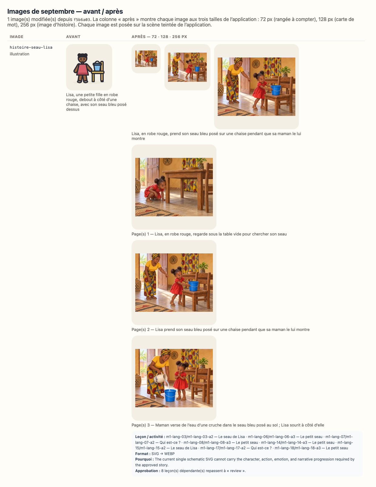

# Reconfirmation visuelle — 1ère maternelle, septembre 2026

`SEPTEMBER_RICH_MEDIA_BATCH_FROZEN_FOR_REVIEW` — les images de ce lot sont figées ;
leurs fichiers, dimensions et empreintes exactes sont consignés dans
`docs/september-rich-media-audit.json` jusqu’à la décision du propriétaire.

> **Ce document est généré** (`npm run review:visual`). Il ne demande pas une relecture
> complète : les mots lus à l’enfant et à l’adulte, les objectifs, les durées et le matériel
> sont **identiques, octet pour octet**, à la version que vous aviez acceptée — le script qui
> écrit ce document le vérifie avant d’écrire, et refuse d’écrire si ce n’est pas vrai. Seules
> **les images** ont changé.

## Ce qui s’est passé

1 image(s) de septembre ont été remplacées localement par des illustrations
WebP plus chaleureuses, expressives et proches d’un album préscolaire. Une histoire peut utiliser
une courte séquence alignée sur ses pages existantes. Aucun texte n’a été réécrit ; les personnages,
objets, quantités, actions et décors doivent être jugés contre le texte approuvé.
Les 50 autres images, dont toutes les formes géométriques, n’ont pas bougé.

L’empreinte d’une approbation couvre les octets de chaque image montrée à l’enfant (ISSUE-026).
Les approbations de **8 leçon(s)** de cette classe ont donc été annulées — pas
re-tamponnées — et ce document vous demande de confirmer que les nouvelles images servent
toujours ce que chaque leçon enseigne (ADR-048).

## La planche avant / après

La planche montre chaque image aux trois tailles de l’application : 72 px (une rangée à
compter), 128 px (une carte de mot), 256 px (l’image d’une histoire).

## Les images que cette classe montre — 1

| Image                | Type         | Description avant                                                                                | Description après                                                                               | Leçons de cette classe                                                                             |
| -------------------- | ------------ | ------------------------------------------------------------------------------------------------ | ----------------------------------------------------------------------------------------------- | -------------------------------------------------------------------------------------------------- |
| `histoire-seau-lisa` | illustration | Lisa, une petite fille en robe rouge, debout à côté d’une chaise, avec son seau bleu posé dessus | Lisa, en robe rouge, prend son seau bleu posé sur une chaise pendant que sa maman le lui montre | 8 — m1-lang-03, m1-lang-06, m1-lang-07, m1-lang-08, m1-lang-14, m1-lang-15, m1-lang-17, m1-lang-18 |

## Séquences des histoires

| Histoire             | Page(s) | Fichier                                                 | Description exacte de la scène                                                              |
| -------------------- | ------- | ------------------------------------------------------- | ------------------------------------------------------------------------------------------- |
| `histoire-seau-lisa` | 1       | `public/media/illustrations/histoire-seau-lisa-01.webp` | Lisa, en robe rouge, regarde sous la table vide pour chercher son seau                      |
| `histoire-seau-lisa` | 2       | `public/media/illustrations/histoire-seau-lisa-02.webp` | Lisa prend son seau bleu posé sur une chaise pendant que sa maman le lui montre             |
| `histoire-seau-lisa` | 3       | `public/media/illustrations/histoire-seau-lisa-03.webp` | Maman verse de l’eau d’une cruche dans le seau bleu posé au sol ; Lisa sourit à côté d’elle |

## Texte approuvé et image montrée, page par page

Ces extraits sont les mots canoniques réellement affichés dans l’application. Ils permettent
de juger chaque scène sans devoir consulter un autre fichier. Une histoire avance par groupes
de 3 lignes ; une comptine tient sur une seule page.

### `histoire-seau-lisa` — Le petit seau

- **Page 1 — image :** `public/media/illustrations/histoire-seau-lisa-01.webp`
  - Description accessible : Lisa, en robe rouge, regarde sous la table vide pour chercher son seau
  - Texte affiché :
    > Dans mon seau il y a de l’eau,
    > dans ma main il y a le seau,
    > sur ma tête il n’y a rien —
    > sur ma tête il y a ma main !

### `histoire-seau-lisa` — Le seau de Lisa

- **Page 1 — image :** `public/media/illustrations/histoire-seau-lisa-01.webp`
  - Description accessible : Lisa, en robe rouge, regarde sous la table vide pour chercher son seau
  - Texte affiché :
    > Lisa veut de l’eau. Elle cherche son seau.
    > Le seau n’est pas sur la table.
    > Lisa regarde sous la table : pas de seau.

- **Page 2 — image :** `public/media/illustrations/histoire-seau-lisa-02.webp`
  - Description accessible : Lisa prend son seau bleu posé sur une chaise pendant que sa maman le lui montre
  - Texte affiché :
    > Lisa regarde derrière la porte : pas de seau.
    > Maman dit : « Regarde sur la chaise. »
    > Le seau est sur la chaise ! Lisa prend son seau.

- **Page 3 — image :** `public/media/illustrations/histoire-seau-lisa-03.webp`
  - Description accessible : Maman verse de l’eau d’une cruche dans le seau bleu posé au sol ; Lisa sourit à côté d’elle
  - Texte affiché :
    > Maman verse de l’eau dans le seau.
    > Lisa sourit : elle a son eau.

## Résumé

| Mesure                                        | Valeur                          |
| --------------------------------------------- | ------------------------------- |
| Leçons de la classe                           | 88                              |
| Leçons concernées (approbation annulée)       | 8                               |
| Leçons non concernées                         | 80                              |
| Images modifiées (toutes classes)             | 1                               |
| Images inchangées (toutes classes)            | 50                              |
| Texte pédagogique modifié (enfant ou adulte)  | **0** — vérifié champ par champ |
| Objectifs modifiés                            | **0** — vérifié                 |
| Progression, programme, calendrier modifiés   | **0** — vérifié                 |
| Associations image / activité corrigées       | 0                               |
| Seuls les images, leur description ont changé | **oui**                         |

## Chaque activité concernée, semaine par semaine

Pour chaque ligne : aucun texte lu à l’enfant, aucun texte lu à l’adulte, aucun objectif et
aucune progression n’a changé (vérifié avant l’écriture de ce document). **La seule raison**
du changement d’empreinte est la ligne « image » : ses octets ont changé, et l’empreinte d’une
approbation couvre les octets de chaque image montrée (ISSUE-026, ADR-048).

### Semaine 1 — 1 leçon(s)

| Jour | Leçon                           | Activité                        | Image                | Rôle                            | Empreinte avant | Empreinte après | Description avant                                                                                | Description après                                                                               | Texte enfant | Texte adulte | Objectif / progression |
| ---- | ------------------------------- | ------------------------------- | -------------------- | ------------------------------- | --------------- | --------------- | ------------------------------------------------------------------------------------------------ | ----------------------------------------------------------------------------------------------- | ------------ | ------------ | ---------------------- |
| 3    | `m1-lang-03` L’histoire du seau | `m1-lang-03-a2` Le seau de Lisa | `histoire-seau-lisa` | principale — montrée à l’enfant | `61b3f228a5b7`  | `42b9840e6bde`  | Lisa, une petite fille en robe rouge, debout à côté d’une chaise, avec son seau bleu posé dessus | Lisa, en robe rouge, prend son seau bleu posé sur une chaise pendant que sa maman le lui montre | inchangé     | inchangé     | inchangés              |

### Semaine 2 — 3 leçon(s)

| Jour | Leçon                                  | Activité                      | Image                | Rôle                            | Empreinte avant | Empreinte après | Description avant                                                                                | Description après                                                                               | Texte enfant | Texte adulte | Objectif / progression |
| ---- | -------------------------------------- | ----------------------------- | -------------------- | ------------------------------- | --------------- | --------------- | ------------------------------------------------------------------------------------------------ | ----------------------------------------------------------------------------------------------- | ------------ | ------------ | ---------------------- |
| 6    | `m1-lang-06` Je connais quatre mots    | `m1-lang-06-a3` Le petit seau | `histoire-seau-lisa` | principale — montrée à l’enfant | `61b3f228a5b7`  | `42b9840e6bde`  | Lisa, une petite fille en robe rouge, debout à côté d’une chaise, avec son seau bleu posé dessus | Lisa, en robe rouge, prend son seau bleu posé sur une chaise pendant que sa maman le lui montre | inchangé     | inchangé     | inchangés              |
| 7    | `m1-lang-07` Je reconnais Lisa         | `m1-lang-07-a2` Qui est-ce ?  | `histoire-seau-lisa` | principale — montrée à l’enfant | `61b3f228a5b7`  | `42b9840e6bde`  | Lisa, une petite fille en robe rouge, debout à côté d’une chaise, avec son seau bleu posé dessus | Lisa, en robe rouge, prend son seau bleu posé sur une chaise pendant que sa maman le lui montre | inchangé     | inchangé     | inchangés              |
| 8    | `m1-lang-08` Je raconte ce que je fais | `m1-lang-08-a3` Le petit seau | `histoire-seau-lisa` | principale — montrée à l’enfant | `61b3f228a5b7`  | `42b9840e6bde`  | Lisa, une petite fille en robe rouge, debout à côté d’une chaise, avec son seau bleu posé dessus | Lisa, en robe rouge, prend son seau bleu posé sur une chaise pendant que sa maman le lui montre | inchangé     | inchangé     | inchangés              |

### Semaine 3 — 1 leçon(s)

| Jour | Leçon                              | Activité                      | Image                | Rôle                            | Empreinte avant | Empreinte après | Description avant                                                                                | Description après                                                                               | Texte enfant | Texte adulte | Objectif / progression |
| ---- | ---------------------------------- | ----------------------------- | -------------------- | ------------------------------- | --------------- | --------------- | ------------------------------------------------------------------------------------------------ | ----------------------------------------------------------------------------------------------- | ------------ | ------------ | ---------------------- |
| 14   | `m1-lang-14` Je dis ce que je fais | `m1-lang-14-a3` Le petit seau | `histoire-seau-lisa` | principale — montrée à l’enfant | `61b3f228a5b7`  | `42b9840e6bde`  | Lisa, une petite fille en robe rouge, debout à côté d’une chaise, avec son seau bleu posé dessus | Lisa, en robe rouge, prend son seau bleu posé sur une chaise pendant que sa maman le lui montre | inchangé     | inchangé     | inchangés              |

### Semaine 4 — 3 leçon(s)

| Jour | Leçon                                  | Activité                        | Image                | Rôle                            | Empreinte avant | Empreinte après | Description avant                                                                                | Description après                                                                               | Texte enfant | Texte adulte | Objectif / progression |
| ---- | -------------------------------------- | ------------------------------- | -------------------- | ------------------------------- | --------------- | --------------- | ------------------------------------------------------------------------------------------------ | ----------------------------------------------------------------------------------------------- | ------------ | ------------ | ---------------------- |
| 15   | `m1-lang-15` Encore l’histoire du seau | `m1-lang-15-a2` Le seau de Lisa | `histoire-seau-lisa` | principale — montrée à l’enfant | `61b3f228a5b7`  | `42b9840e6bde`  | Lisa, une petite fille en robe rouge, debout à côté d’une chaise, avec son seau bleu posé dessus | Lisa, en robe rouge, prend son seau bleu posé sur une chaise pendant que sa maman le lui montre | inchangé     | inchangé     | inchangés              |
| 17   | `m1-lang-17` Je montre le personnage   | `m1-lang-17-a2` Qui est-ce ?    | `histoire-seau-lisa` | principale — montrée à l’enfant | `61b3f228a5b7`  | `42b9840e6bde`  | Lisa, une petite fille en robe rouge, debout à côté d’une chaise, avec son seau bleu posé dessus | Lisa, en robe rouge, prend son seau bleu posé sur une chaise pendant que sa maman le lui montre | inchangé     | inchangé     | inchangés              |
| 18   | `m1-lang-18` Les mots de mon corps     | `m1-lang-18-a3` Le petit seau   | `histoire-seau-lisa` | principale — montrée à l’enfant | `61b3f228a5b7`  | `42b9840e6bde`  | Lisa, une petite fille en robe rouge, debout à côté d’une chaise, avec son seau bleu posé dessus | Lisa, en robe rouge, prend son seau bleu posé sur une chaise pendant que sa maman le lui montre | inchangé     | inchangé     | inchangés              |

## Ce que l’on vous demande

Pour chaque image de la planche, et en pensant à l’enfant qui la regarde pendant l’activité :

1. l’image montre-t-elle bien **la chose, le geste ou la scène que la leçon nomme**, sans détail
   contradictoire ou distrayant ?
2. est-elle **lisible à 72 px** quand elle est répétée dans une rangée à compter ?
3. la description (`alt`, lue par une synthèse vocale à une famille francophone) dit-elle ce
   que l’image montre ?
4. voyez-vous une image qui **contredit** ce qu’une leçon dit — geste, quantité, personnage,
   objet, émotion, lieu ou ordre temporel ?
5. dans chaque histoire, l’identité, l’âge, la peau et les vêtements des personnages restent-ils
   cohérents, et chaque scène correspond-elle vraiment aux lignes de sa page ?

Répondez **`accepted`** (les images conviennent), ou **`accepted-with-modifications`** en
nommant l’image et ce qui doit changer.

## Comment le résultat est enregistré

Une entrée `full-review` par semaine dans `content/reviews/history.json`, avec la date, la
décision et votre résumé ; puis `npx tsx scripts/approve-week.ts --level=maternelle-1 --week=<n>` recalcule chaque empreinte sur les images d’aujourd’hui — aucune empreinte
n’est reprise d’avant. Une image à corriger est redessinée dans `tools/media/build.ts`, la
planche est régénérée, et ce document aussi.
