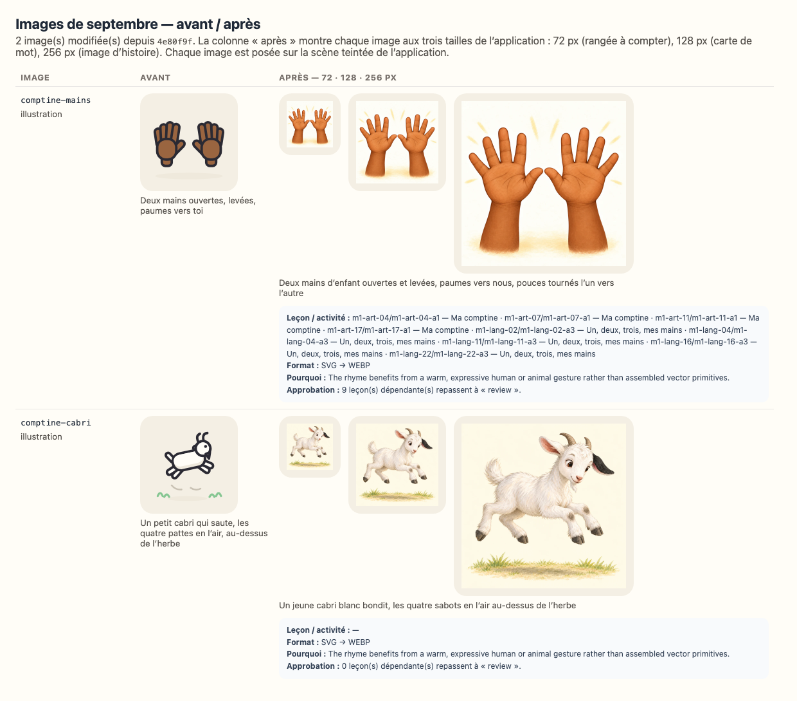

# Reconfirmation visuelle — 1ère maternelle, septembre 2026

`SEPTEMBER_RICH_MEDIA_BATCH_FROZEN_FOR_REVIEW` — les images de ce lot sont figées ;
leurs fichiers, dimensions et empreintes exactes sont consignés dans
`docs/september-rich-media-audit.json` jusqu’à la décision du propriétaire.

> **Ce document est généré** (`npm run review:visual`). Il ne demande pas une relecture
> complète : les mots lus à l’enfant et à l’adulte, les objectifs, les durées et le matériel
> sont **identiques, octet pour octet**, à la version que vous aviez acceptée — le script qui
> écrit ce document le vérifie avant d’écrire, et refuse d’écrire si ce n’est pas vrai. Seules
> **les images** ont changé.

## Ce qui s’est passé

2 image(s) de septembre ont été remplacées localement par des illustrations
WebP plus chaleureuses, expressives et proches d’un album préscolaire. Une histoire peut utiliser
une courte séquence alignée sur ses pages existantes. Aucun texte n’a été réécrit ; les personnages,
objets, quantités, actions et décors doivent être jugés contre le texte approuvé.
Les 49 autres images, dont toutes les formes géométriques, n’ont pas bougé.

L’empreinte d’une approbation couvre les octets de chaque image montrée à l’enfant (ISSUE-026).
Les approbations de **9 leçon(s)** de cette classe ont donc été annulées — pas
re-tamponnées — et ce document vous demande de confirmer que les nouvelles images servent
toujours ce que chaque leçon enseigne (ADR-048).

## La planche avant / après

La planche montre chaque image aux trois tailles de l’application : 72 px (une rangée à
compter), 128 px (une carte de mot), 256 px (l’image d’une histoire).

## Les images que cette classe montre — 1

| Image            | Type         | Description avant                            | Description après                                                                          | Leçons de cette classe                                                                                     |
| ---------------- | ------------ | -------------------------------------------- | ------------------------------------------------------------------------------------------ | ---------------------------------------------------------------------------------------------------------- |
| `comptine-mains` | illustration | Deux mains ouvertes, levées, paumes vers toi | Deux mains d’enfant ouvertes et levées, paumes vers nous, pouces tournés l’un vers l’autre | 9 — m1-lang-02, m1-lang-04, m1-lang-11, m1-lang-16, m1-lang-22, m1-art-04, m1-art-07, m1-art-11, m1-art-17 |

## Texte approuvé et image montrée, page par page

Ces extraits sont les mots canoniques réellement affichés dans l’application. Ils permettent
de juger chaque scène sans devoir consulter un autre fichier. Une histoire avance par groupes
de 3 lignes ; une comptine tient sur une seule page.

### `comptine-mains` — Un, deux, trois, mes mains

- **Page 1 — image :** `public/media/illustrations/comptine-mains.webp`
  - Description accessible : Deux mains d’enfant ouvertes et levées, paumes vers nous, pouces tournés l’un vers l’autre
  - Texte affiché :
    > Un, deux, trois,
    > mes mains sont là.
    > Un, deux, trois,
    > je les cache… les voilà !

### `comptine-mains` — Mes deux mains

- **Page 1 — image :** `public/media/illustrations/comptine-mains.webp`
  - Description accessible : Deux mains d’enfant ouvertes et levées, paumes vers nous, pouces tournés l’un vers l’autre
  - Texte affiché :
    > Voici ma tête,
    > voici mes épaules,
    > voici mes deux mains
    > qui montent tout là-haut.
    > Voici mes genoux,
    > voici mes deux pieds,
    > et voici mon ventre
    > qui se met à rigoler !

## Résumé

| Mesure                                        | Valeur                          |
| --------------------------------------------- | ------------------------------- |
| Leçons de la classe                           | 88                              |
| Leçons concernées (approbation annulée)       | 9                               |
| Leçons non concernées                         | 79                              |
| Images modifiées (toutes classes)             | 2                               |
| Images inchangées (toutes classes)            | 49                              |
| Texte pédagogique modifié (enfant ou adulte)  | **0** — vérifié champ par champ |
| Objectifs modifiés                            | **0** — vérifié                 |
| Progression, programme, calendrier modifiés   | **0** — vérifié                 |
| Associations image / activité corrigées       | 0                               |
| Seuls les images, leur description ont changé | **oui**                         |

## Chaque activité concernée, semaine par semaine

Pour chaque ligne : aucun texte lu à l’enfant, aucun texte lu à l’adulte, aucun objectif et
aucune progression n’a changé (vérifié avant l’écriture de ce document). **La seule raison**
du changement d’empreinte est la ligne « image » : ses octets ont changé, et l’empreinte d’une
approbation couvre les octets de chaque image montrée (ISSUE-026, ADR-048).

### Semaine 1 — 3 leçon(s)

| Jour | Leçon                                     | Activité                                   | Image            | Rôle                            | Empreinte avant | Empreinte après | Description avant                            | Description après                                                                          | Texte enfant | Texte adulte | Objectif / progression |
| ---- | ----------------------------------------- | ------------------------------------------ | ---------------- | ------------------------------- | --------------- | --------------- | -------------------------------------------- | ------------------------------------------------------------------------------------------ | ------------ | ------------ | ---------------------- |
| 2    | `m1-lang-02` Encore des mots de la maison | `m1-lang-02-a3` Un, deux, trois, mes mains | `comptine-mains` | principale — montrée à l’enfant | `ad1e83e04b06`  | `36a5f6124120`  | Deux mains ouvertes, levées, paumes vers toi | Deux mains d’enfant ouvertes et levées, paumes vers nous, pouces tournés l’un vers l’autre | inchangé     | inchangé     | inchangés              |
| 4    | `m1-art-04` Ma comptine                   | `m1-art-04-a1` Ma comptine                 | `comptine-mains` | principale — montrée à l’enfant | `ad1e83e04b06`  | `36a5f6124120`  | Deux mains ouvertes, levées, paumes vers toi | Deux mains d’enfant ouvertes et levées, paumes vers nous, pouces tournés l’un vers l’autre | inchangé     | inchangé     | inchangés              |
| 4    | `m1-lang-04` Je dis ce que je fais        | `m1-lang-04-a3` Un, deux, trois, mes mains | `comptine-mains` | principale — montrée à l’enfant | `ad1e83e04b06`  | `36a5f6124120`  | Deux mains ouvertes, levées, paumes vers toi | Deux mains d’enfant ouvertes et levées, paumes vers nous, pouces tournés l’un vers l’autre | inchangé     | inchangé     | inchangés              |

### Semaine 2 — 1 leçon(s)

| Jour | Leçon                   | Activité                   | Image            | Rôle                            | Empreinte avant | Empreinte après | Description avant                            | Description après                                                                          | Texte enfant | Texte adulte | Objectif / progression |
| ---- | ----------------------- | -------------------------- | ---------------- | ------------------------------- | --------------- | --------------- | -------------------------------------------- | ------------------------------------------------------------------------------------------ | ------------ | ------------ | ---------------------- |
| 7    | `m1-art-07` Ma comptine | `m1-art-07-a1` Ma comptine | `comptine-mains` | principale — montrée à l’enfant | `ad1e83e04b06`  | `36a5f6124120`  | Deux mains ouvertes, levées, paumes vers toi | Deux mains d’enfant ouvertes et levées, paumes vers nous, pouces tournés l’un vers l’autre | inchangé     | inchangé     | inchangés              |

### Semaine 3 — 2 leçon(s)

| Jour | Leçon                          | Activité                                   | Image            | Rôle                            | Empreinte avant | Empreinte après | Description avant                            | Description après                                                                          | Texte enfant | Texte adulte | Objectif / progression |
| ---- | ------------------------------ | ------------------------------------------ | ---------------- | ------------------------------- | --------------- | --------------- | -------------------------------------------- | ------------------------------------------------------------------------------------------ | ------------ | ------------ | ---------------------- |
| 11   | `m1-art-11` Ma comptine        | `m1-art-11-a1` Ma comptine                 | `comptine-mains` | principale — montrée à l’enfant | `ad1e83e04b06`  | `36a5f6124120`  | Deux mains ouvertes, levées, paumes vers toi | Deux mains d’enfant ouvertes et levées, paumes vers nous, pouces tournés l’un vers l’autre | inchangé     | inchangé     | inchangés              |
| 11   | `m1-lang-11` Ma main, mon pied | `m1-lang-11-a3` Un, deux, trois, mes mains | `comptine-mains` | principale — montrée à l’enfant | `ad1e83e04b06`  | `36a5f6124120`  | Deux mains ouvertes, levées, paumes vers toi | Deux mains d’enfant ouvertes et levées, paumes vers nous, pouces tournés l’un vers l’autre | inchangé     | inchangé     | inchangés              |

### Semaine 4 — 2 leçon(s)

| Jour | Leçon                      | Activité                                   | Image            | Rôle                            | Empreinte avant | Empreinte après | Description avant                            | Description après                                                                          | Texte enfant | Texte adulte | Objectif / progression |
| ---- | -------------------------- | ------------------------------------------ | ---------------- | ------------------------------- | --------------- | --------------- | -------------------------------------------- | ------------------------------------------------------------------------------------------ | ------------ | ------------ | ---------------------- |
| 16   | `m1-lang-16` J’écoute bien | `m1-lang-16-a3` Un, deux, trois, mes mains | `comptine-mains` | principale — montrée à l’enfant | `ad1e83e04b06`  | `36a5f6124120`  | Deux mains ouvertes, levées, paumes vers toi | Deux mains d’enfant ouvertes et levées, paumes vers nous, pouces tournés l’un vers l’autre | inchangé     | inchangé     | inchangés              |
| 17   | `m1-art-17` Ma comptine    | `m1-art-17-a1` Ma comptine                 | `comptine-mains` | principale — montrée à l’enfant | `ad1e83e04b06`  | `36a5f6124120`  | Deux mains ouvertes, levées, paumes vers toi | Deux mains d’enfant ouvertes et levées, paumes vers nous, pouces tournés l’un vers l’autre | inchangé     | inchangé     | inchangés              |

### Semaine 5 — 1 leçon(s)

| Jour | Leçon                                 | Activité                                   | Image            | Rôle                            | Empreinte avant | Empreinte après | Description avant                            | Description après                                                                          | Texte enfant | Texte adulte | Objectif / progression |
| ---- | ------------------------------------- | ------------------------------------------ | ---------------- | ------------------------------- | --------------- | --------------- | -------------------------------------------- | ------------------------------------------------------------------------------------------ | ------------ | ------------ | ---------------------- |
| 22   | `m1-lang-22` Tout ce que je sais dire | `m1-lang-22-a3` Un, deux, trois, mes mains | `comptine-mains` | principale — montrée à l’enfant | `ad1e83e04b06`  | `36a5f6124120`  | Deux mains ouvertes, levées, paumes vers toi | Deux mains d’enfant ouvertes et levées, paumes vers nous, pouces tournés l’un vers l’autre | inchangé     | inchangé     | inchangés              |

## Ce que l’on vous demande

Pour chaque image de la planche, et en pensant à l’enfant qui la regarde pendant l’activité :

1. l’image montre-t-elle bien **la chose, le geste ou la scène que la leçon nomme**, sans détail
   contradictoire ou distrayant ?
2. est-elle **lisible à 72 px** quand elle est répétée dans une rangée à compter ?
3. la description (`alt`, lue par une synthèse vocale à une famille francophone) dit-elle ce
   que l’image montre ?
4. voyez-vous une image qui **contredit** ce qu’une leçon dit — geste, quantité, personnage,
   objet, émotion, lieu ou ordre temporel ?
5. dans chaque histoire, l’identité, l’âge, la peau et les vêtements des personnages restent-ils
   cohérents, et chaque scène correspond-elle vraiment aux lignes de sa page ?

Répondez **`accepted`** (les images conviennent), ou **`accepted-with-modifications`** en
nommant l’image et ce qui doit changer.

## Comment le résultat est enregistré

Une entrée `full-review` par semaine dans `content/reviews/history.json`, avec la date, la
décision et votre résumé ; puis `npx tsx scripts/approve-week.ts --level=maternelle-1 --week=<n>` recalcule chaque empreinte sur les images d’aujourd’hui — aucune empreinte
n’est reprise d’avant. Une image à corriger est redessinée dans `tools/media/build.ts`, la
planche est régénérée, et ce document aussi.
