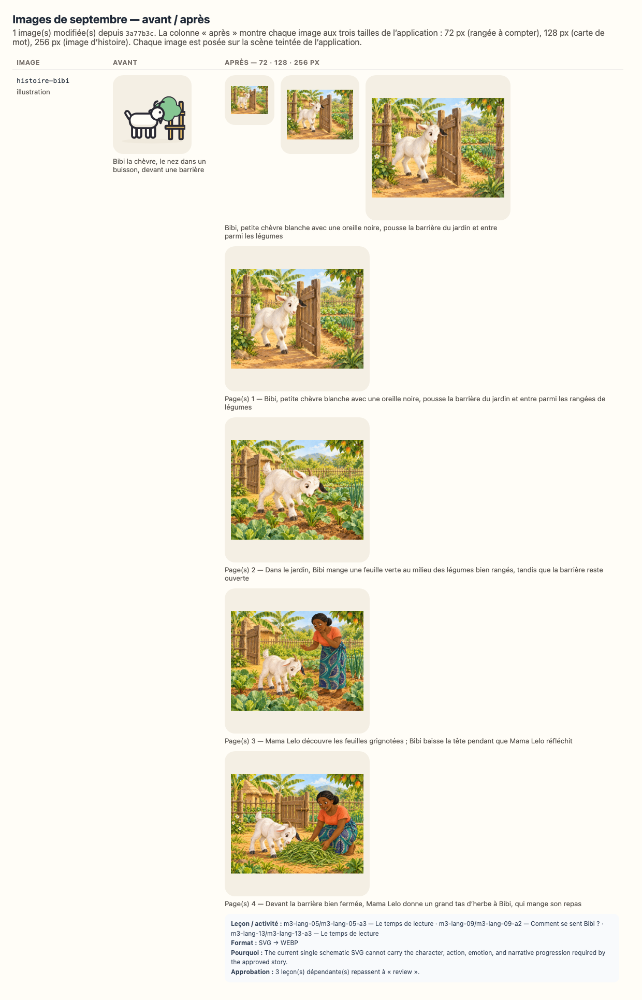

# Reconfirmation visuelle — 3ème maternelle, septembre 2026

`SEPTEMBER_RICH_MEDIA_BATCH_FROZEN_FOR_REVIEW` — les images de ce lot sont figées ;
leurs fichiers, dimensions et empreintes exactes sont consignés dans
`docs/september-rich-media-audit.json` jusqu’à la décision du propriétaire.

> **Ce document est généré** (`npm run review:visual`). Il ne demande pas une relecture
> complète : les mots lus à l’enfant et à l’adulte, les objectifs, les durées et le matériel
> sont **identiques, octet pour octet**, à la version que vous aviez acceptée — le script qui
> écrit ce document le vérifie avant d’écrire, et refuse d’écrire si ce n’est pas vrai. Seules
> **les images** ont changé.

## Ce qui s’est passé

1 image(s) de septembre ont été remplacées localement par des illustrations
WebP plus chaleureuses, expressives et proches d’un album préscolaire. Une histoire peut utiliser
une courte séquence alignée sur ses pages existantes. Aucun texte n’a été réécrit ; les personnages,
objets, quantités, actions et décors doivent être jugés contre le texte approuvé.
Les 50 autres images, dont toutes les formes géométriques, n’ont pas bougé.

L’empreinte d’une approbation couvre les octets de chaque image montrée à l’enfant (ISSUE-026).
Les approbations de **3 leçon(s)** de cette classe ont donc été annulées — pas
re-tamponnées — et ce document vous demande de confirmer que les nouvelles images servent
toujours ce que chaque leçon enseigne (ADR-048).

## La planche avant / après

La planche montre chaque image aux trois tailles de l’application : 72 px (une rangée à
compter), 128 px (une carte de mot), 256 px (l’image d’une histoire).

## Les images que cette classe montre — 1

| Image           | Type         | Description avant                                           | Description après                                                                                           | Leçons de cette classe                 |
| --------------- | ------------ | ----------------------------------------------------------- | ----------------------------------------------------------------------------------------------------------- | -------------------------------------- |
| `histoire-bibi` | illustration | Bibi la chèvre, le nez dans un buisson, devant une barrière | Bibi, petite chèvre blanche avec une oreille noire, pousse la barrière du jardin et entre parmi les légumes | 3 — m3-lang-05, m3-lang-09, m3-lang-13 |

## Séquences des histoires

| Histoire        | Page(s) | Fichier                                            | SHA-256                                                                   | Description exacte de la scène                                                                                         |
| --------------- | ------- | -------------------------------------------------- | ------------------------------------------------------------------------- | ---------------------------------------------------------------------------------------------------------------------- |
| `histoire-bibi` | 1       | `public/media/illustrations/histoire-bibi-01.webp` | `sha256:1e15939369feba99abb39e6b32d2d5b745638601d7e578935479f468066e48e4` | Bibi, petite chèvre blanche avec une oreille noire, pousse la barrière du jardin et entre parmi les rangées de légumes |
| `histoire-bibi` | 2       | `public/media/illustrations/histoire-bibi-02.webp` | `sha256:7c6c8dadd01b16a11cb38bcc3df17f633581ec8ed6f1f14669f94449e1853112` | Dans le jardin, Bibi mange une feuille verte au milieu des légumes bien rangés, tandis que la barrière reste ouverte   |
| `histoire-bibi` | 3       | `public/media/illustrations/histoire-bibi-03.webp` | `sha256:b8f2d6bbbf0e3c54a8c06fc23147c233405afac65a0aa89465f8d68f268951ee` | Mama Lelo découvre les feuilles grignotées ; Bibi baisse la tête pendant que Mama Lelo réfléchit                       |
| `histoire-bibi` | 4       | `public/media/illustrations/histoire-bibi-04.webp` | `sha256:7d39bca6f7dbd7181a1e492511ba4c632a0472bbbbc0916cb0710129a374db0e` | Devant la barrière bien fermée, Mama Lelo donne un grand tas d’herbe à Bibi, qui mange son repas                       |

L’empreinte d’approbation ne se limite pas au hash principal affiché dans le tableau des
activités : `assetFingerprint` inclut la description et le SHA-256 de **chaque cadre**, puis
la table `pageFrames`. `lessonDigest` reçoit cette empreinte complète pour toute leçon qui
utilise l’image ; modifier n’importe quel cadre annule donc l’approbation.

## Texte approuvé et image montrée, page par page

Ces extraits sont les mots canoniques réellement affichés dans l’application. Ils permettent
de juger chaque scène sans devoir consulter un autre fichier. Une histoire avance par groupes
de 3 lignes ; une comptine tient sur une seule page.

### `histoire-bibi` — Bibi, la chèvre curieuse

- **Page 1 — image :** `public/media/illustrations/histoire-bibi-01.webp`
  - Description accessible : Bibi, petite chèvre blanche avec une oreille noire, pousse la barrière du jardin et entre parmi les rangées de légumes
  - Texte affiché :
    > Bibi est une chèvre blanche avec une tache noire sur l’oreille.
    > Bibi veut toujours savoir ce qu’il y a plus loin.
    > Un jour, elle pousse la barrière avec sa tête, et la barrière s’ouvre.

- **Page 2 — image :** `public/media/illustrations/histoire-bibi-02.webp`
  - Description accessible : Dans le jardin, Bibi mange une feuille verte au milieu des légumes bien rangés, tandis que la barrière reste ouverte
  - Texte affiché :
    > Bibi marche jusqu’au jardin. Dans le jardin, il y a des feuilles vertes, bien rangées.
    > Elle mange une feuille. Puis deux. Puis trois. C’est délicieux.
    > Mais ce jardin, c’est le jardin de mama Lelo. Et ces feuilles, ce sont ses légumes.

- **Page 3 — image :** `public/media/illustrations/histoire-bibi-03.webp`
  - Description accessible : Mama Lelo découvre les feuilles grignotées ; Bibi baisse la tête pendant que Mama Lelo réfléchit
  - Texte affiché :
    > Mama Lelo arrive. « Bibi ! Encore toi ! »
    > Bibi baisse la tête. Elle sait qu’elle a fait une bêtise.
    > Mama Lelo réfléchit. Une chèvre a besoin de manger, c’est vrai. Mais pas dans son jardin.

- **Page 4 — image :** `public/media/illustrations/histoire-bibi-04.webp`
  - Description accessible : Devant la barrière bien fermée, Mama Lelo donne un grand tas d’herbe à Bibi, qui mange son repas
  - Texte affiché :
    > Alors elle coupe de l’herbe, beaucoup d’herbe, et elle la donne à Bibi.
    > « Voilà ton repas à toi, dit-elle. Les légumes, c’est pour nous. »
    > Depuis ce jour, Bibi a son tas d’herbe, et le jardin a sa barrière bien fermée.

## Résumé

| Mesure                                        | Valeur                          |
| --------------------------------------------- | ------------------------------- |
| Leçons de la classe                           | 88                              |
| Leçons concernées (approbation annulée)       | 3                               |
| Leçons non concernées                         | 85                              |
| Images modifiées (toutes classes)             | 1                               |
| Images inchangées (toutes classes)            | 50                              |
| Texte pédagogique modifié (enfant ou adulte)  | **0** — vérifié champ par champ |
| Objectifs modifiés                            | **0** — vérifié                 |
| Progression, programme, calendrier modifiés   | **0** — vérifié                 |
| Associations image / activité corrigées       | 0                               |
| Seuls les images, leur description ont changé | **oui**                         |

## Chaque activité concernée, semaine par semaine

Pour chaque ligne : aucun texte lu à l’enfant, aucun texte lu à l’adulte, aucun objectif et
aucune progression n’a changé (vérifié avant l’écriture de ce document). **La seule raison**
du changement d’empreinte est la présentation visuelle : les octets des images, leurs descriptions
accessibles et, pour une séquence, sa table page-cadre participent à l’empreinte couverte par
l’approbation (ISSUE-026, ADR-048).
Pour une séquence, les colonnes « empreinte » ci-dessous abrègent le hash du cadre principal ;
la section « Séquences des histoires » donne tous les SHA-256 et explique l’empreinte complète.

### Semaine 2 — 2 leçon(s)

| Jour | Leçon                              | Activité                               | Image           | Rôle                            | Empreinte avant | Empreinte après | Description avant                                           | Description après                                                                                           | Texte enfant | Texte adulte | Objectif / progression |
| ---- | ---------------------------------- | -------------------------------------- | --------------- | ------------------------------- | --------------- | --------------- | ----------------------------------------------------------- | ----------------------------------------------------------------------------------------------------------- | ------------ | ------------ | ---------------------- |
| 5    | `m3-lang-05` Je raconte ma journée | `m3-lang-05-a3` Le temps de lecture    | `histoire-bibi` | principale — montrée à l’enfant | `115a43f2d89d`  | `1e15939369fe`  | Bibi la chèvre, le nez dans un buisson, devant une barrière | Bibi, petite chèvre blanche avec une oreille noire, pousse la barrière du jardin et entre parmi les légumes | inchangé     | inchangé     | inchangés              |
| 9    | `m3-lang-09` Les émotions de Bibi  | `m3-lang-09-a2` Comment se sent Bibi ? | `histoire-bibi` | principale — montrée à l’enfant | `115a43f2d89d`  | `1e15939369fe`  | Bibi la chèvre, le nez dans un buisson, devant une barrière | Bibi, petite chèvre blanche avec une oreille noire, pousse la barrière du jardin et entre parmi les légumes | inchangé     | inchangé     | inchangés              |

### Semaine 3 — 1 leçon(s)

| Jour | Leçon                           | Activité                            | Image           | Rôle                            | Empreinte avant | Empreinte après | Description avant                                           | Description après                                                                                           | Texte enfant | Texte adulte | Objectif / progression |
| ---- | ------------------------------- | ----------------------------------- | --------------- | ------------------------------- | --------------- | --------------- | ----------------------------------------------------------- | ----------------------------------------------------------------------------------------------------------- | ------------ | ------------ | ---------------------- |
| 13   | `m3-lang-13` Les mots du marché | `m3-lang-13-a3` Le temps de lecture | `histoire-bibi` | principale — montrée à l’enfant | `115a43f2d89d`  | `1e15939369fe`  | Bibi la chèvre, le nez dans un buisson, devant une barrière | Bibi, petite chèvre blanche avec une oreille noire, pousse la barrière du jardin et entre parmi les légumes | inchangé     | inchangé     | inchangés              |

## Ce que l’on vous demande

Pour chaque image de la planche, et en pensant à l’enfant qui la regarde pendant l’activité :

1. l’image montre-t-elle bien **la chose, le geste ou la scène que la leçon nomme**, sans détail
   contradictoire ou distrayant ?
2. est-elle **lisible à 72 px** quand elle est répétée dans une rangée à compter ?
3. la description (`alt`, lue par une synthèse vocale à une famille francophone) dit-elle ce
   que l’image montre ?
4. voyez-vous une image qui **contredit** ce qu’une leçon dit — geste, quantité, personnage,
   objet, émotion, lieu ou ordre temporel ?
5. dans chaque histoire, l’identité, l’âge, la peau et les vêtements des personnages restent-ils
   cohérents, et chaque scène correspond-elle vraiment aux lignes de sa page ?

Répondez **`accepted`** (les images conviennent), ou **`accepted-with-modifications`** en
nommant l’image et ce qui doit changer.

## Comment le résultat est enregistré

Une entrée `full-review` par semaine dans `content/reviews/history.json`, avec la date, la
décision et votre résumé ; puis `npx tsx scripts/approve-week.ts --level=maternelle-3 --week=<n>` recalcule chaque empreinte sur les images d’aujourd’hui — aucune empreinte
n’est reprise d’avant. Une image à corriger est redessinée dans `tools/media/build.ts`, la
planche est régénérée, et ce document aussi.
