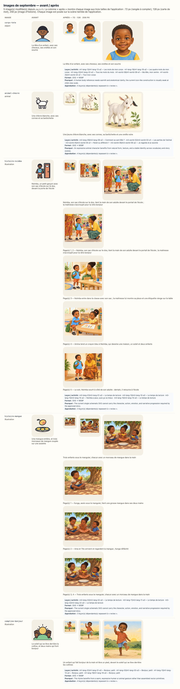

# Reconfirmation visuelle — 3ème maternelle, septembre 2026

`SEPTEMBER_RICH_MEDIA_PILOT_FROZEN_FOR_REVIEW` — les cinq images du pilote sont figées ;
leurs fichiers, dimensions et empreintes exactes sont consignés dans
`docs/september-rich-media-audit.json` jusqu’à la décision du propriétaire.

> **Ce document est généré** (`npm run review:visual`). Il ne demande pas une relecture
> complète : les mots lus à l’enfant et à l’adulte, les objectifs, les durées et le matériel
> sont **identiques, octet pour octet**, à la version que vous aviez acceptée — le script qui
> écrit ce document le vérifie avant d’écrire, et refuse d’écrire si ce n’est pas vrai. Seules
> **les images** ont changé.

## Ce qui s’est passé

Cinq images représentatives de septembre ont été remplacées localement par des illustrations
WebP plus chaleureuses, expressives et proches d’un album préscolaire. Deux histoires utilisent
désormais une courte séquence alignée sur leurs pages existantes. Aucun texte n’a été réécrit ;
les personnages, objets, quantités, actions et décors doivent être jugés contre le texte approuvé.
Les 46 autres images, dont toutes les formes géométriques, n’ont pas bougé.

L’empreinte d’une approbation couvre les octets de chaque image montrée à l’enfant (ISSUE-026).
Les approbations de **10 leçon(s)** de cette classe ont donc été annulées — pas
re-tamponnées — et ce document vous demande de confirmer que les nouvelles images servent
toujours ce que chaque leçon enseigne (ADR-048).

## La planche avant / après

La planche montre chaque image aux trois tailles de l’application : 72 px (une rangée à
compter), 128 px (une carte de mot), 256 px (l’image d’une histoire).

## Les images que cette classe montre — 3

| Image             | Type         | Description avant                                                                   | Description après                                                                                                                             | Leçons de cette classe                                |
| ----------------- | ------------ | ----------------------------------------------------------------------------------- | --------------------------------------------------------------------------------------------------------------------------------------------- | ----------------------------------------------------- |
| `animal-chevre`   | animal       | Une chèvre blanche, avec ses cornes et sa barbichette                               | Une jeune chèvre blanche, avec ses cornes, sa barbichette et une oreille noire                                                                | 4 — m3-lang-09, m3-world-02, m3-world-05, m3-world-06 |
| `histoire-nsimba` | illustration | Nsimba, un petit garçon avec son sac d’école sur le dos, devant la porte de l’école | Nsimba, son sac d’école sur le dos, tient la main de son adulte devant le portail de l’école ; la maitresse s’accroupit pour lui dire bonjour | 3 — m3-lang-01, m3-lang-10, m3-lang-15                |
| `histoire-mangue` | illustration | Une mangue entière, et trois morceaux de mangue coupés sur une assiette             | Trois enfants sous le manguier, chacun avec un morceau de mangue dans la main                                                                 | 3 — m3-lang-02, m3-lang-11, m3-lang-22                |

## Séquences des histoires

| Histoire          | Page(s) | Fichier                                              | Description exacte de la scène                                                                                                                |
| ----------------- | ------- | ---------------------------------------------------- | --------------------------------------------------------------------------------------------------------------------------------------------- |
| `histoire-nsimba` | 1, 2    | `public/media/illustrations/histoire-nsimba-01.webp` | Nsimba, son sac d’école sur le dos, tient la main de son adulte devant le portail de l’école ; la maitresse s’accroupit pour lui dire bonjour |
| `histoire-nsimba` | 3       | `public/media/illustrations/histoire-nsimba-02.webp` | Nsimba entre dans la classe avec son sac ; la maitresse lui montre sa place et une étiquette vierge sur la table                              |
| `histoire-nsimba` | 4       | `public/media/illustrations/histoire-nsimba-03.webp` | Amina tend un crayon bleu à Nsimba, qui dessine une maison, un soleil et deux enfants                                                         |
| `histoire-nsimba` | 5       | `public/media/illustrations/histoire-nsimba-04.webp` | Le soir, Nsimba sourit à côté de son adulte : demain, il retourne à l’école                                                                   |
| `histoire-mangue` | 1       | `public/media/illustrations/histoire-mangue-01.webp` | Ilunga, assis sous le manguier, tient une grosse mangue dans ses deux mains                                                                   |
| `histoire-mangue` | 2       | `public/media/illustrations/histoire-mangue-02.webp` | Ama et Tito arrivent et regardent la mangue ; Ilunga réfléchit                                                                                |
| `histoire-mangue` | 3, 4    | `public/media/illustrations/histoire-mangue-03.webp` | Trois enfants sous le manguier, chacun avec un morceau de mangue dans la main                                                                 |

## Texte approuvé et image montrée, page par page

Ces extraits sont les mots canoniques réellement affichés dans l’application. Ils permettent
de juger chaque scène sans devoir consulter un autre fichier. Une histoire avance par groupes
de 3 lignes ; une comptine tient sur une seule page.

### `histoire-nsimba` — Le premier jour de Nsimba

- **Page 1 — image :** `public/media/illustrations/histoire-nsimba-01.webp`
  - Description accessible : Nsimba, son sac d’école sur le dos, tient la main de son adulte devant le portail de l’école ; la maitresse s’accroupit pour lui dire bonjour
  - Texte affiché :
    > Ce matin, Nsimba met sa chemise, ses chaussures, et son petit sac sur le dos.
    > Aujourd’hui, c’est son premier jour à l’école.
    > Sur le chemin, son ventre fait un drôle de nœud. Nsimba serre très fort la main de son adulte.

- **Page 2 — image :** `public/media/illustrations/histoire-nsimba-01.webp`
  - Description accessible : Nsimba, son sac d’école sur le dos, tient la main de son adulte devant le portail de l’école ; la maitresse s’accroupit pour lui dire bonjour
  - Texte affiché :
    > Devant le portail, il y a beaucoup d’enfants. Beaucoup de bruit. Beaucoup de pieds.
    > Nsimba voudrait rentrer à la maison.
    > La maitresse s’accroupit devant lui. « Bonjour. Moi, c’est madame Kalala. Et toi ? »

- **Page 3 — image :** `public/media/illustrations/histoire-nsimba-02.webp`
  - Description accessible : Nsimba entre dans la classe avec son sac ; la maitresse lui montre sa place et une étiquette vierge sur la table
  - Texte affiché :
    > Nsimba ne dit rien. Puis, tout doucement : « Nsimba. »
    > « Viens, Nsimba, dit la maitresse. Ta place est ici, avec ton prénom dessus. »
    > Sur la table, il y a son prénom. Rien qu’à lui.

- **Page 4 — image :** `public/media/illustrations/histoire-nsimba-03.webp`
  - Description accessible : Amina tend un crayon bleu à Nsimba, qui dessine une maison, un soleil et deux enfants
  - Texte affiché :
    > À côté, une fille lui tend un crayon bleu. « Tu veux ? Moi, c’est Amina. »
    > Nsimba prend le crayon. Il dessine une maison, un soleil, et deux enfants.
    > Le soir, son adulte demande : « Alors, cette école ? »

- **Page 5 — image :** `public/media/illustrations/histoire-nsimba-04.webp`
  - Description accessible : Le soir, Nsimba sourit à côté de son adulte : demain, il retourne à l’école
  - Texte affiché :
    > Nsimba répond : « Demain, j’y retourne. »

### `histoire-mangue` — La mangue partagée

- **Page 1 — image :** `public/media/illustrations/histoire-mangue-01.webp`
  - Description accessible : Ilunga, assis sous le manguier, tient une grosse mangue dans ses deux mains
  - Texte affiché :
    > Ilunga trouve une grosse mangue sous l’arbre. Une seule.
    > Il la met dans ses deux mains. Elle est lourde, et elle sent très bon.
    > Ilunga s’assoit pour la manger tout seul.

- **Page 2 — image :** `public/media/illustrations/histoire-mangue-02.webp`
  - Description accessible : Ama et Tito arrivent et regardent la mangue ; Ilunga réfléchit
  - Texte affiché :
    > Mais voilà Ama, sa voisine. Et voilà Tito, son petit frère. Ils regardent la mangue.
    > Ils sont trois, et il y a une seule mangue.
    > Ilunga réfléchit. Une mangue, trois enfants. Comment faire ?

- **Page 3 — image :** `public/media/illustrations/histoire-mangue-03.webp`
  - Description accessible : Trois enfants sous le manguier, chacun avec un morceau de mangue dans la main
  - Texte affiché :
    > Il coupe la mangue en trois morceaux : un, deux, trois.
    > Un morceau pour Ama. Un morceau pour Tito. Un morceau pour lui.
    > « Maintenant, dit Ilunga, on a tous quelque chose. »

- **Page 4 — image :** `public/media/illustrations/histoire-mangue-03.webp`
  - Description accessible : Trois enfants sous le manguier, chacun avec un morceau de mangue dans la main
  - Texte affiché :
    > Et la mangue, partagée en trois, a un gout encore meilleur.

## Résumé

| Mesure                                        | Valeur                          |
| --------------------------------------------- | ------------------------------- |
| Leçons de la classe                           | 88                              |
| Leçons concernées (approbation annulée)       | 10                              |
| Leçons non concernées                         | 78                              |
| Images modifiées (toutes classes)             | 5                               |
| Images inchangées (toutes classes)            | 46                              |
| Texte pédagogique modifié (enfant ou adulte)  | **0** — vérifié champ par champ |
| Objectifs modifiés                            | **0** — vérifié                 |
| Progression, programme, calendrier modifiés   | **0** — vérifié                 |
| Associations image / activité corrigées       | 0                               |
| Seuls les images, leur description ont changé | **oui**                         |

## Chaque activité concernée, semaine par semaine

Pour chaque ligne : aucun texte lu à l’enfant, aucun texte lu à l’adulte, aucun objectif et
aucune progression n’a changé (vérifié avant l’écriture de ce document). **La seule raison**
du changement d’empreinte est la ligne « image » : ses octets ont changé, et l’empreinte d’une
approbation couvre les octets de chaque image montrée (ISSUE-026, ADR-048).

### Semaine 1 — 2 leçon(s)

| Jour | Leçon                                 | Activité                            | Image             | Rôle                            | Empreinte avant | Empreinte après | Description avant                                                                   | Description après                                                                                                                             | Texte enfant | Texte adulte | Objectif / progression |
| ---- | ------------------------------------- | ----------------------------------- | ----------------- | ------------------------------- | --------------- | --------------- | ----------------------------------------------------------------------------------- | --------------------------------------------------------------------------------------------------------------------------------------------- | ------------ | ------------ | ---------------------- |
| 1    | `m3-lang-01` Bonjour ! Je me présente | `m3-lang-01-a3` Le temps de lecture | `histoire-nsimba` | principale — montrée à l’enfant | `4b4ab397cf3e`  | `f50ceb4a3ac0`  | Nsimba, un petit garçon avec son sac d’école sur le dos, devant la porte de l’école | Nsimba, son sac d’école sur le dos, tient la main de son adulte devant le portail de l’école ; la maitresse s’accroupit pour lui dire bonjour | inchangé     | inchangé     | inchangés              |
| 2    | `m3-lang-02` Les mots de l’école      | `m3-lang-02-a3` Le temps de lecture | `histoire-mangue` | principale — montrée à l’enfant | `0c002c3d3fe6`  | `bbc2f54f554a`  | Une mangue entière, et trois morceaux de mangue coupés sur une assiette             | Trois enfants sous le manguier, chacun avec un morceau de mangue dans la main                                                                 | inchangé     | inchangé     | inchangés              |

### Semaine 2 — 2 leçon(s)

| Jour | Leçon                                    | Activité                                 | Image           | Rôle                                                    | Empreinte avant | Empreinte après | Description avant                                     | Description après                                                              | Texte enfant | Texte adulte | Objectif / progression |
| ---- | ---------------------------------------- | ---------------------------------------- | --------------- | ------------------------------------------------------- | --------------- | --------------- | ----------------------------------------------------- | ------------------------------------------------------------------------------ | ------------ | ------------ | ---------------------- |
| 5    | `m3-world-02` Les animaux autour de nous | `m3-world-02-a1` Les parties de l’animal | `animal-chevre` | principale — montrée à l’enfant                         | `62993dc9a45a`  | `9af0f57f755f`  | Une chèvre blanche, avec ses cornes et sa barbichette | Une jeune chèvre blanche, avec ses cornes, sa barbichette et une oreille noire | inchangé     | inchangé     | inchangés              |
| 9    | `m3-lang-09` Les émotions de Bibi        | `m3-lang-09-a2` Comment se sent Bibi ?   | `animal-chevre` | secondaire — liée au texte ou à l’activité, non montrée | `62993dc9a45a`  | `9af0f57f755f`  | Une chèvre blanche, avec ses cornes et sa barbichette | Une jeune chèvre blanche, avec ses cornes, sa barbichette et une oreille noire | inchangé     | inchangé     | inchangés              |

### Semaine 3 — 2 leçon(s)

| Jour | Leçon                                 | Activité                            | Image             | Rôle                            | Empreinte avant | Empreinte après | Description avant                                                                   | Description après                                                                                                                             | Texte enfant | Texte adulte | Objectif / progression |
| ---- | ------------------------------------- | ----------------------------------- | ----------------- | ------------------------------- | --------------- | --------------- | ----------------------------------------------------------------------------------- | --------------------------------------------------------------------------------------------------------------------------------------------- | ------------ | ------------ | ---------------------- |
| 10   | `m3-lang-10` Je décris ce que je vois | `m3-lang-10-a3` Le temps de lecture | `histoire-nsimba` | principale — montrée à l’enfant | `4b4ab397cf3e`  | `f50ceb4a3ac0`  | Nsimba, un petit garçon avec son sac d’école sur le dos, devant la porte de l’école | Nsimba, son sac d’école sur le dos, tient la main de son adulte devant le portail de l’école ; la maitresse s’accroupit pour lui dire bonjour | inchangé     | inchangé     | inchangés              |
| 11   | `m3-lang-11` Raconte-moi Kumu         | `m3-lang-11-a3` Le temps de lecture | `histoire-mangue` | principale — montrée à l’enfant | `0c002c3d3fe6`  | `bbc2f54f554a`  | Une mangue entière, et trois morceaux de mangue coupés sur une assiette             | Trois enfants sous le manguier, chacun avec un morceau de mangue dans la main                                                                 | inchangé     | inchangé     | inchangés              |

### Semaine 4 — 3 leçon(s)

| Jour | Leçon                                                  | Activité                                        | Image             | Rôle                            | Empreinte avant | Empreinte après | Description avant                                                                   | Description après                                                                                                                             | Texte enfant | Texte adulte | Objectif / progression |
| ---- | ------------------------------------------------------ | ----------------------------------------------- | ----------------- | ------------------------------- | --------------- | --------------- | ----------------------------------------------------------------------------------- | --------------------------------------------------------------------------------------------------------------------------------------------- | ------------ | ------------ | ---------------------- |
| 15   | `m3-lang-15` L’histoire du premier jour                | `m3-lang-15-a2` Nsimba a peur, puis ça va mieux | `histoire-nsimba` | principale — montrée à l’enfant | `4b4ab397cf3e`  | `f50ceb4a3ac0`  | Nsimba, un petit garçon avec son sac d’école sur le dos, devant la porte de l’école | Nsimba, son sac d’école sur le dos, tient la main de son adulte devant le portail de l’école ; la maitresse s’accroupit pour lui dire bonjour | inchangé     | inchangé     | inchangés              |
| 15   | `m3-lang-15` L’histoire du premier jour                | `m3-lang-15-a3` Le temps de lecture             | `histoire-nsimba` | principale — montrée à l’enfant | `4b4ab397cf3e`  | `f50ceb4a3ac0`  | Nsimba, un petit garçon avec son sac d’école sur le dos, devant la porte de l’école | Nsimba, son sac d’école sur le dos, tient la main de son adulte devant le portail de l’école ; la maitresse s’accroupit pour lui dire bonjour | inchangé     | inchangé     | inchangés              |
| 15   | `m3-world-05` L’animal et ses parties                  | `m3-world-05-a1` Pareil ou différent ?          | `animal-chevre`   | principale — montrée à l’enfant | `62993dc9a45a`  | `9af0f57f755f`  | Une chèvre blanche, avec ses cornes et sa barbichette                               | Une jeune chèvre blanche, avec ses cornes, sa barbichette et une oreille noire                                                                | inchangé     | inchangé     | inchangés              |
| 19   | `m3-world-06` Prendre soin d’un animal ou d’une plante | `m3-world-06-a2` Je regarde et je raconte       | `animal-chevre`   | principale — montrée à l’enfant | `62993dc9a45a`  | `9af0f57f755f`  | Une chèvre blanche, avec ses cornes et sa barbichette                               | Une jeune chèvre blanche, avec ses cornes, sa barbichette et une oreille noire                                                                | inchangé     | inchangé     | inchangés              |

### Semaine 5 — 1 leçon(s)

| Jour | Leçon                                 | Activité                            | Image             | Rôle                            | Empreinte avant | Empreinte après | Description avant                                                       | Description après                                                             | Texte enfant | Texte adulte | Objectif / progression |
| ---- | ------------------------------------- | ----------------------------------- | ----------------- | ------------------------------- | --------------- | --------------- | ----------------------------------------------------------------------- | ----------------------------------------------------------------------------- | ------------ | ------------ | ---------------------- |
| 22   | `m3-lang-22` Tout ce que je sais dire | `m3-lang-22-a3` Le temps de lecture | `histoire-mangue` | principale — montrée à l’enfant | `0c002c3d3fe6`  | `bbc2f54f554a`  | Une mangue entière, et trois morceaux de mangue coupés sur une assiette | Trois enfants sous le manguier, chacun avec un morceau de mangue dans la main | inchangé     | inchangé     | inchangés              |

## Ce que l’on vous demande

Pour chaque image de la planche, et en pensant à l’enfant qui la regarde pendant l’activité :

1. l’image montre-t-elle bien **la chose, le geste ou la scène que la leçon nomme**, sans détail
   contradictoire ou distrayant ?
2. est-elle **lisible à 72 px** quand elle est répétée dans une rangée à compter ?
3. la description (`alt`, lue par une synthèse vocale à une famille francophone) dit-elle ce
   que l’image montre ?
4. voyez-vous une image qui **contredit** ce qu’une leçon dit — geste, quantité, personnage,
   objet, émotion, lieu ou ordre temporel ?
5. dans chaque histoire, l’identité, l’âge, la peau et les vêtements des personnages restent-ils
   cohérents, et chaque scène correspond-elle vraiment aux lignes de sa page ?

Répondez **`accepted`** (les images conviennent), ou **`accepted-with-modifications`** en
nommant l’image et ce qui doit changer.

## Comment le résultat est enregistré

Une entrée `full-review` par semaine dans `content/reviews/history.json`, avec la date, la
décision et votre résumé ; puis `npx tsx scripts/approve-week.ts --level=maternelle-3 --week=<n>` recalcule chaque empreinte sur les images d’aujourd’hui — aucune empreinte
n’est reprise d’avant. Une image à corriger est redessinée dans `tools/media/build.ts`, la
planche est régénérée, et ce document aussi.
