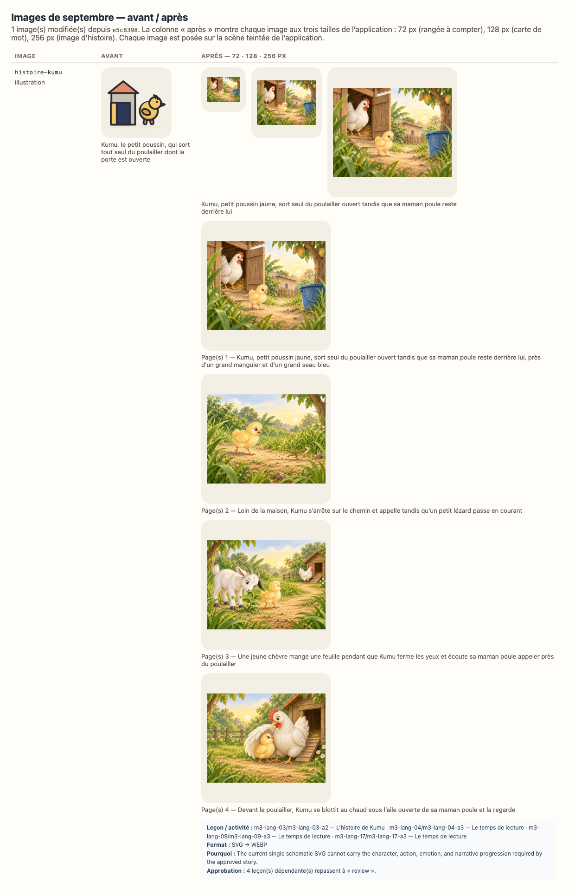

# Reconfirmation visuelle — 3ème maternelle, septembre 2026

`SEPTEMBER_RICH_MEDIA_BATCH_FROZEN_FOR_REVIEW` — les images de ce lot sont figées ;
leurs fichiers, dimensions et empreintes exactes sont consignés dans
`docs/september-rich-media-audit.json` jusqu’à la décision du propriétaire.

> **Ce document est généré** (`npm run review:visual`). Il ne demande pas une relecture
> complète : les mots lus à l’enfant et à l’adulte, les objectifs, les durées et le matériel
> sont **identiques, octet pour octet**, à la version que vous aviez acceptée — le script qui
> écrit ce document le vérifie avant d’écrire, et refuse d’écrire si ce n’est pas vrai. Seules
> **les images** ont changé.

## Ce qui s’est passé

1 image(s) de septembre ont été remplacées localement par des illustrations
WebP plus chaleureuses, expressives et proches d’un album préscolaire. Une histoire peut utiliser
une courte séquence alignée sur ses pages existantes. Aucun texte n’a été réécrit ; les personnages,
objets, quantités, actions et décors doivent être jugés contre le texte approuvé.
Les 50 autres images, dont toutes les formes géométriques, n’ont pas bougé.

L’empreinte d’une approbation couvre les octets de chaque image montrée à l’enfant (ISSUE-026).
Les approbations de **4 leçon(s)** de cette classe ont donc été annulées — pas
re-tamponnées — et ce document vous demande de confirmer que les nouvelles images servent
toujours ce que chaque leçon enseigne (ADR-048).

## La planche avant / après

La planche montre chaque image aux trois tailles de l’application : 72 px (une rangée à
compter), 128 px (une carte de mot), 256 px (l’image d’une histoire).

## Les images que cette classe montre — 1

| Image           | Type         | Description avant                                                                  | Description après                                                                                      | Leçons de cette classe                             |
| --------------- | ------------ | ---------------------------------------------------------------------------------- | ------------------------------------------------------------------------------------------------------ | -------------------------------------------------- |
| `histoire-kumu` | illustration | Kumu, le petit poussin, qui sort tout seul du poulailler dont la porte est ouverte | Kumu, petit poussin jaune, sort seul du poulailler ouvert tandis que sa maman poule reste derrière lui | 4 — m3-lang-03, m3-lang-04, m3-lang-09, m3-lang-17 |

## Séquences des histoires

| Histoire        | Page(s) | Fichier                                            | SHA-256                                                                   | Description exacte de la scène                                                                                                                           |
| --------------- | ------- | -------------------------------------------------- | ------------------------------------------------------------------------- | -------------------------------------------------------------------------------------------------------------------------------------------------------- |
| `histoire-kumu` | 1       | `public/media/illustrations/histoire-kumu-01.webp` | `sha256:027ee3b6119faf82c9b58d974846b73e5531b71d5309516b0d8446715f9542be` | Kumu, petit poussin jaune, sort seul du poulailler ouvert tandis que sa maman poule reste derrière lui, près d’un grand manguier et d’un grand seau bleu |
| `histoire-kumu` | 2       | `public/media/illustrations/histoire-kumu-02.webp` | `sha256:46c72911eec6b4765ccfa37e66ced474e13db28cd5c8144ec20d9517755723b9` | Loin de la maison, Kumu s’arrête sur le chemin et appelle tandis qu’un petit lézard passe en courant                                                     |
| `histoire-kumu` | 3       | `public/media/illustrations/histoire-kumu-03.webp` | `sha256:f1762fda23ece1bd3c7ce0460b50e49f4b6b299c55b29ba6e2db820cb7d6755a` | Une jeune chèvre mange une feuille pendant que Kumu ferme les yeux et écoute sa maman poule appeler près du poulailler                                   |
| `histoire-kumu` | 4       | `public/media/illustrations/histoire-kumu-04.webp` | `sha256:3c3a60bdd2fc1913b8394fb8643fa98a545a51ff91fb11d25abf56282b57b13a` | Devant le poulailler, Kumu se blottit au chaud sous l’aile ouverte de sa maman poule et la regarde                                                       |

L’empreinte d’approbation ne se limite pas au hash principal affiché dans le tableau des
activités : `assetFingerprint` inclut la description et le SHA-256 de **chaque cadre**, puis
la table `pageFrames`. `lessonDigest` reçoit cette empreinte complète pour toute leçon qui
utilise l’image ; modifier n’importe quel cadre annule donc l’approbation.

## Texte approuvé et image montrée, page par page

Ces extraits sont les mots canoniques réellement affichés dans l’application. Ils permettent
de juger chaque scène sans devoir consulter un autre fichier. Une histoire avance par groupes
de 3 lignes ; une comptine tient sur une seule page.

### `histoire-kumu` — Kumu, le petit poussin

- **Page 1 — image :** `public/media/illustrations/histoire-kumu-01.webp`
  - Description accessible : Kumu, petit poussin jaune, sort seul du poulailler ouvert tandis que sa maman poule reste derrière lui, près d’un grand manguier et d’un grand seau bleu
  - Texte affiché :
    > Kumu est un petit poussin jaune. Il vit derrière la maison, avec sa maman poule.
    > Un matin, Kumu voit la porte du poulailler ouverte. Il sort tout seul, sans rien dire.
    > Dehors, tout est grand. L’herbe est grande. Le manguier est grand. Le seau est grand.

- **Page 2 — image :** `public/media/illustrations/histoire-kumu-02.webp`
  - Description accessible : Loin de la maison, Kumu s’arrête sur le chemin et appelle tandis qu’un petit lézard passe en courant
  - Texte affiché :
    > Kumu marche, marche, marche. Puis il s’arrête. Il ne voit plus la maison.
    > « Piou ! Piou ! » Kumu appelle. Personne ne répond.
    > Un lézard passe. « Tu as vu ma maman ? » demande Kumu. « Non », dit le lézard, et il file.

- **Page 3 — image :** `public/media/illustrations/histoire-kumu-03.webp`
  - Description accessible : Une jeune chèvre mange une feuille pendant que Kumu ferme les yeux et écoute sa maman poule appeler près du poulailler
  - Texte affiché :
    > Une chèvre passe. « Tu as vu ma maman ? » demande Kumu. « Non », dit la chèvre, et elle mange une feuille.
    > Alors Kumu ferme les yeux et il écoute. Il entend : « Cot ! Cot ! Cot ! »
    > C’est la voix de sa maman ! Kumu court vers la voix, et il arrive au poulailler.

- **Page 4 — image :** `public/media/illustrations/histoire-kumu-04.webp`
  - Description accessible : Devant le poulailler, Kumu se blottit au chaud sous l’aile ouverte de sa maman poule et la regarde
  - Texte affiché :
    > Maman poule ouvre son aile. Kumu se cache dessous. Il est bien au chaud.
    > « La prochaine fois, dit maman poule, tu m’appelles avant de sortir. »
    > Et Kumu répond : « Piou ! », ce qui veut dire oui.

## Résumé

| Mesure                                        | Valeur                          |
| --------------------------------------------- | ------------------------------- |
| Leçons de la classe                           | 88                              |
| Leçons concernées (approbation annulée)       | 4                               |
| Leçons non concernées                         | 84                              |
| Images modifiées (toutes classes)             | 1                               |
| Images inchangées (toutes classes)            | 50                              |
| Texte pédagogique modifié (enfant ou adulte)  | **0** — vérifié champ par champ |
| Objectifs modifiés                            | **0** — vérifié                 |
| Progression, programme, calendrier modifiés   | **0** — vérifié                 |
| Associations image / activité corrigées       | 0                               |
| Seuls les images, leur description ont changé | **oui**                         |

## Chaque activité concernée, semaine par semaine

Pour chaque ligne : aucun texte lu à l’enfant, aucun texte lu à l’adulte, aucun objectif et
aucune progression n’a changé (vérifié avant l’écriture de ce document). **La seule raison**
du changement d’empreinte est la ligne « image » : ses octets ont changé, et l’empreinte d’une
approbation couvre les octets de chaque image montrée (ISSUE-026, ADR-048).
Pour une séquence, les colonnes « empreinte » ci-dessous abrègent le hash du cadre principal ;
la section « Séquences des histoires » donne tous les SHA-256 et explique l’empreinte complète.

### Semaine 1 — 2 leçon(s)

| Jour | Leçon                                    | Activité                            | Image           | Rôle                            | Empreinte avant | Empreinte après | Description avant                                                                  | Description après                                                                                      | Texte enfant | Texte adulte | Objectif / progression |
| ---- | ---------------------------------------- | ----------------------------------- | --------------- | ------------------------------- | --------------- | --------------- | ---------------------------------------------------------------------------------- | ------------------------------------------------------------------------------------------------------ | ------------ | ------------ | ---------------------- |
| 3    | `m3-lang-03` J’écoute l’histoire de Kumu | `m3-lang-03-a2` L’histoire de Kumu  | `histoire-kumu` | principale — montrée à l’enfant | `c5158e03e9af`  | `027ee3b6119f`  | Kumu, le petit poussin, qui sort tout seul du poulailler dont la porte est ouverte | Kumu, petit poussin jaune, sort seul du poulailler ouvert tandis que sa maman poule reste derrière lui | inchangé     | inchangé     | inchangés              |
| 4    | `m3-lang-04` Les syllabes de mon prénom  | `m3-lang-04-a3` Le temps de lecture | `histoire-kumu` | principale — montrée à l’enfant | `c5158e03e9af`  | `027ee3b6119f`  | Kumu, le petit poussin, qui sort tout seul du poulailler dont la porte est ouverte | Kumu, petit poussin jaune, sort seul du poulailler ouvert tandis que sa maman poule reste derrière lui | inchangé     | inchangé     | inchangés              |

### Semaine 2 — 1 leçon(s)

| Jour | Leçon                             | Activité                            | Image           | Rôle                            | Empreinte avant | Empreinte après | Description avant                                                                  | Description après                                                                                      | Texte enfant | Texte adulte | Objectif / progression |
| ---- | --------------------------------- | ----------------------------------- | --------------- | ------------------------------- | --------------- | --------------- | ---------------------------------------------------------------------------------- | ------------------------------------------------------------------------------------------------------ | ------------ | ------------ | ---------------------- |
| 9    | `m3-lang-09` Les émotions de Bibi | `m3-lang-09-a3` Le temps de lecture | `histoire-kumu` | principale — montrée à l’enfant | `c5158e03e9af`  | `027ee3b6119f`  | Kumu, le petit poussin, qui sort tout seul du poulailler dont la porte est ouverte | Kumu, petit poussin jaune, sort seul du poulailler ouvert tandis que sa maman poule reste derrière lui | inchangé     | inchangé     | inchangés              |

### Semaine 4 — 1 leçon(s)

| Jour | Leçon                           | Activité                            | Image           | Rôle                            | Empreinte avant | Empreinte après | Description avant                                                                  | Description après                                                                                      | Texte enfant | Texte adulte | Objectif / progression |
| ---- | ------------------------------- | ----------------------------------- | --------------- | ------------------------------- | --------------- | --------------- | ---------------------------------------------------------------------------------- | ------------------------------------------------------------------------------------------------------ | ------------ | ------------ | ---------------------- |
| 17   | `m3-lang-17` Je trouve une rime | `m3-lang-17-a3` Le temps de lecture | `histoire-kumu` | principale — montrée à l’enfant | `c5158e03e9af`  | `027ee3b6119f`  | Kumu, le petit poussin, qui sort tout seul du poulailler dont la porte est ouverte | Kumu, petit poussin jaune, sort seul du poulailler ouvert tandis que sa maman poule reste derrière lui | inchangé     | inchangé     | inchangés              |

## Ce que l’on vous demande

Pour chaque image de la planche, et en pensant à l’enfant qui la regarde pendant l’activité :

1. l’image montre-t-elle bien **la chose, le geste ou la scène que la leçon nomme**, sans détail
   contradictoire ou distrayant ?
2. est-elle **lisible à 72 px** quand elle est répétée dans une rangée à compter ?
3. la description (`alt`, lue par une synthèse vocale à une famille francophone) dit-elle ce
   que l’image montre ?
4. voyez-vous une image qui **contredit** ce qu’une leçon dit — geste, quantité, personnage,
   objet, émotion, lieu ou ordre temporel ?
5. dans chaque histoire, l’identité, l’âge, la peau et les vêtements des personnages restent-ils
   cohérents, et chaque scène correspond-elle vraiment aux lignes de sa page ?

Répondez **`accepted`** (les images conviennent), ou **`accepted-with-modifications`** en
nommant l’image et ce qui doit changer.

## Comment le résultat est enregistré

Une entrée `full-review` par semaine dans `content/reviews/history.json`, avec la date, la
décision et votre résumé ; puis `npx tsx scripts/approve-week.ts --level=maternelle-3 --week=<n>` recalcule chaque empreinte sur les images d’aujourd’hui — aucune empreinte
n’est reprise d’avant. Une image à corriger est redessinée dans `tools/media/build.ts`, la
planche est régénérée, et ce document aussi.
