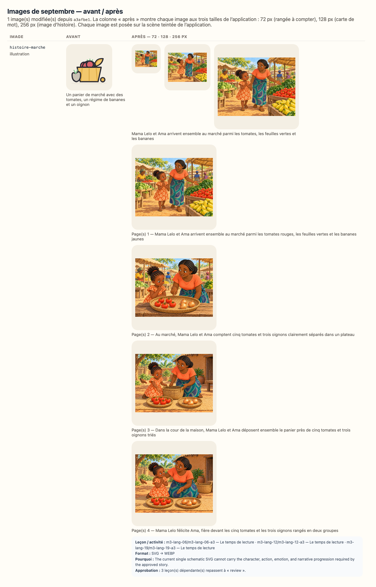

# Reconfirmation visuelle — 3ème maternelle, septembre 2026

`SEPTEMBER_RICH_MEDIA_BATCH_FROZEN_FOR_REVIEW` — les images de ce lot sont figées ;
leurs fichiers, dimensions et empreintes exactes sont consignés dans
`docs/september-rich-media-audit.json` jusqu’à la décision du propriétaire.

> **Ce document est généré** (`npm run review:visual`). Il ne demande pas une relecture
> complète : les mots lus à l’enfant et à l’adulte, les objectifs, les durées et le matériel
> sont **identiques, octet pour octet**, à la version que vous aviez acceptée — le script qui
> écrit ce document le vérifie avant d’écrire, et refuse d’écrire si ce n’est pas vrai. Seules
> **les images** ont changé.

## Ce qui s’est passé

1 image(s) de septembre ont été remplacées localement par des illustrations
WebP plus chaleureuses, expressives et proches d’un album préscolaire. Une histoire peut utiliser
une courte séquence alignée sur ses pages existantes. Aucun texte n’a été réécrit ; les personnages,
objets, quantités, actions et décors doivent être jugés contre le texte approuvé.
Les 50 autres images, dont toutes les formes géométriques, n’ont pas bougé.

L’empreinte d’une approbation couvre les octets de chaque image montrée à l’enfant (ISSUE-026).
Les approbations de **3 leçon(s)** de cette classe ont donc été annulées — pas
re-tamponnées — et ce document vous demande de confirmer que les nouvelles images servent
toujours ce que chaque leçon enseigne (ADR-048).

## La planche avant / après

La planche montre chaque image aux trois tailles de l’application : 72 px (une rangée à
compter), 128 px (une carte de mot), 256 px (l’image d’une histoire).

## Les images que cette classe montre — 1

| Image             | Type         | Description avant                                                       | Description après                                                                                  | Leçons de cette classe                 |
| ----------------- | ------------ | ----------------------------------------------------------------------- | -------------------------------------------------------------------------------------------------- | -------------------------------------- |
| `histoire-marche` | illustration | Un panier de marché avec des tomates, un régime de bananes et un oignon | Mama Lelo et Ama arrivent ensemble au marché parmi les tomates, les feuilles vertes et les bananes | 3 — m3-lang-06, m3-lang-12, m3-lang-19 |

## Séquences des histoires

| Histoire          | Page(s) | Fichier                                              | SHA-256                                                                   | Description exacte de la scène                                                                                      |
| ----------------- | ------- | ---------------------------------------------------- | ------------------------------------------------------------------------- | ------------------------------------------------------------------------------------------------------------------- |
| `histoire-marche` | 1       | `public/media/illustrations/histoire-marche-01.webp` | `sha256:4188ac69de8d39f7d742ea5f257cc888067217c28f53816d8afbccd446dbcb75` | Mama Lelo et Ama arrivent ensemble au marché parmi les tomates rouges, les feuilles vertes et les bananes jaunes    |
| `histoire-marche` | 2       | `public/media/illustrations/histoire-marche-02.webp` | `sha256:0a674df545e61cb3868bf8be9fe54c1d220dad13dae7e33ada2a67f337c8bc39` | Au marché, Mama Lelo et Ama comptent cinq tomates et trois oignons clairement séparés dans un plateau               |
| `histoire-marche` | 3       | `public/media/illustrations/histoire-marche-03.webp` | `sha256:c61a2d3efeb08b7af036d979e82ed3f1f324692e3c20f43f1c9df8b7a72bf9db` | Dans la cour de la maison, Mama Lelo et Ama déposent ensemble le panier près de cinq tomates et trois oignons triés |
| `histoire-marche` | 4       | `public/media/illustrations/histoire-marche-04.webp` | `sha256:5cb5137fb4c0a12641f185f5bd6a3f2dcedee3db556b7ca7c4615ceb423e2f00` | Mama Lelo félicite Ama, fière devant les cinq tomates et les trois oignons rangés en deux groupes                   |

L’empreinte d’approbation ne se limite pas au hash principal affiché dans le tableau des
activités : `assetFingerprint` inclut la description et le SHA-256 de **chaque cadre**, puis
la table `pageFrames`. `lessonDigest` reçoit cette empreinte complète pour toute leçon qui
utilise l’image ; modifier n’importe quel cadre annule donc l’approbation.

## Texte approuvé et image montrée, page par page

Ces extraits sont les mots canoniques réellement affichés dans l’application. Ils permettent
de juger chaque scène sans devoir consulter un autre fichier. Une histoire avance par groupes
de 3 lignes ; une comptine tient sur une seule page.

### `histoire-marche` — Le marché de mama Lelo

- **Page 1 — image :** `public/media/illustrations/histoire-marche-01.webp`
  - Description accessible : Mama Lelo et Ama arrivent ensemble au marché parmi les tomates rouges, les feuilles vertes et les bananes jaunes
  - Texte affiché :
    > Le samedi, mama Lelo va au marché, et Ama vient avec elle.
    > Le marché, c’est plein de couleurs : le rouge des tomates, le vert des feuilles, le jaune des bananes.
    > « Ama, dit mama Lelo, tu comptes avec moi ? »

- **Page 2 — image :** `public/media/illustrations/histoire-marche-02.webp`
  - Description accessible : Au marché, Mama Lelo et Ama comptent cinq tomates et trois oignons clairement séparés dans un plateau
  - Texte affiché :
    > Elles achètent des tomates : une, deux, trois, quatre, cinq. Cinq tomates dans le panier.
    > Elles achètent des oignons : un, deux, trois. Trois oignons dans le panier.
    > « Et maintenant, demande mama Lelo, qu’est-ce qu’il y a le plus ? Les tomates ou les oignons ? »

- **Page 3 — image :** `public/media/illustrations/histoire-marche-03.webp`
  - Description accessible : Dans la cour de la maison, Mama Lelo et Ama déposent ensemble le panier près de cinq tomates et trois oignons triés
  - Texte affiché :
    > Ama regarde. Cinq, c’est plus que trois. « Les tomates ! » dit-elle.
    > Sur le chemin du retour, le panier est lourd. Elles le portent à deux, chacune une anse.
    > À la maison, Ama range : les tomates avec les tomates, les oignons avec les oignons.

- **Page 4 — image :** `public/media/illustrations/histoire-marche-04.webp`
  - Description accessible : Mama Lelo félicite Ama, fière devant les cinq tomates et les trois oignons rangés en deux groupes
  - Texte affiché :
    > « Tu as bien travaillé », dit mama Lelo. Et Ama est très fière.

## Résumé

| Mesure                                        | Valeur                          |
| --------------------------------------------- | ------------------------------- |
| Leçons de la classe                           | 88                              |
| Leçons concernées (approbation annulée)       | 3                               |
| Leçons non concernées                         | 85                              |
| Images modifiées (toutes classes)             | 1                               |
| Images inchangées (toutes classes)            | 50                              |
| Texte pédagogique modifié (enfant ou adulte)  | **0** — vérifié champ par champ |
| Objectifs modifiés                            | **0** — vérifié                 |
| Progression, programme, calendrier modifiés   | **0** — vérifié                 |
| Associations image / activité corrigées       | 0                               |
| Seuls les images, leur description ont changé | **oui**                         |

## Chaque activité concernée, semaine par semaine

Pour chaque ligne : aucun texte lu à l’enfant, aucun texte lu à l’adulte, aucun objectif et
aucune progression n’a changé (vérifié avant l’écriture de ce document). **La seule raison**
du changement d’empreinte est la présentation visuelle : les octets des images, leurs descriptions
accessibles et, pour une séquence, sa table page-cadre participent à l’empreinte couverte par
l’approbation (ISSUE-026, ADR-048).
Pour une séquence, les colonnes « empreinte » ci-dessous abrègent le hash du cadre principal ;
la section « Séquences des histoires » donne tous les SHA-256 et explique l’empreinte complète.

### Semaine 2 — 1 leçon(s)

| Jour | Leçon                      | Activité                            | Image             | Rôle                            | Empreinte avant | Empreinte après | Description avant                                                       | Description après                                                                                  | Texte enfant | Texte adulte | Objectif / progression |
| ---- | -------------------------- | ----------------------------------- | ----------------- | ------------------------------- | --------------- | --------------- | ----------------------------------------------------------------------- | -------------------------------------------------------------------------------------------------- | ------------ | ------------ | ---------------------- |
| 6    | `m3-lang-06` Écoute bien ! | `m3-lang-06-a3` Le temps de lecture | `histoire-marche` | principale — montrée à l’enfant | `7fbfdbccf8ea`  | `4188ac69de8d`  | Un panier de marché avec des tomates, un régime de bananes et un oignon | Mama Lelo et Ama arrivent ensemble au marché parmi les tomates, les feuilles vertes et les bananes | inchangé     | inchangé     | inchangés              |

### Semaine 3 — 1 leçon(s)

| Jour | Leçon                                   | Activité                            | Image             | Rôle                            | Empreinte avant | Empreinte après | Description avant                                                       | Description après                                                                                  | Texte enfant | Texte adulte | Objectif / progression |
| ---- | --------------------------------------- | ----------------------------------- | ----------------- | ------------------------------- | --------------- | --------------- | ----------------------------------------------------------------------- | -------------------------------------------------------------------------------------------------- | ------------ | ------------ | ---------------------- |
| 12   | `m3-lang-12` Les mots qui vont ensemble | `m3-lang-12-a3` Le temps de lecture | `histoire-marche` | principale — montrée à l’enfant | `7fbfdbccf8ea`  | `4188ac69de8d`  | Un panier de marché avec des tomates, un régime de bananes et un oignon | Mama Lelo et Ama arrivent ensemble au marché parmi les tomates, les feuilles vertes et les bananes | inchangé     | inchangé     | inchangés              |

### Semaine 4 — 1 leçon(s)

| Jour | Leçon                          | Activité                            | Image             | Rôle                            | Empreinte avant | Empreinte après | Description avant                                                       | Description après                                                                                  | Texte enfant | Texte adulte | Objectif / progression |
| ---- | ------------------------------ | ----------------------------------- | ----------------- | ------------------------------- | --------------- | --------------- | ----------------------------------------------------------------------- | -------------------------------------------------------------------------------------------------- | ------------ | ------------ | ---------------------- |
| 19   | `m3-lang-19` Je range les mots | `m3-lang-19-a3` Le temps de lecture | `histoire-marche` | principale — montrée à l’enfant | `7fbfdbccf8ea`  | `4188ac69de8d`  | Un panier de marché avec des tomates, un régime de bananes et un oignon | Mama Lelo et Ama arrivent ensemble au marché parmi les tomates, les feuilles vertes et les bananes | inchangé     | inchangé     | inchangés              |

## Ce que l’on vous demande

Pour chaque image de la planche, et en pensant à l’enfant qui la regarde pendant l’activité :

1. l’image montre-t-elle bien **la chose, le geste ou la scène que la leçon nomme**, sans détail
   contradictoire ou distrayant ?
2. est-elle **lisible à 72 px** quand elle est répétée dans une rangée à compter ?
3. la description (`alt`, lue par une synthèse vocale à une famille francophone) dit-elle ce
   que l’image montre ?
4. voyez-vous une image qui **contredit** ce qu’une leçon dit — geste, quantité, personnage,
   objet, émotion, lieu ou ordre temporel ?
5. dans chaque histoire, l’identité, l’âge, la peau et les vêtements des personnages restent-ils
   cohérents, et chaque scène correspond-elle vraiment aux lignes de sa page ?

Répondez **`accepted`** (les images conviennent), ou **`accepted-with-modifications`** en
nommant l’image et ce qui doit changer.

## Comment le résultat est enregistré

Une entrée `full-review` par semaine dans `content/reviews/history.json`, avec la date, la
décision et votre résumé ; puis `npx tsx scripts/approve-week.ts --level=maternelle-3 --week=<n>` recalcule chaque empreinte sur les images d’aujourd’hui — aucune empreinte
n’est reprise d’avant. Une image à corriger est redessinée dans `tools/media/build.ts`, la
planche est régénérée, et ce document aussi.
