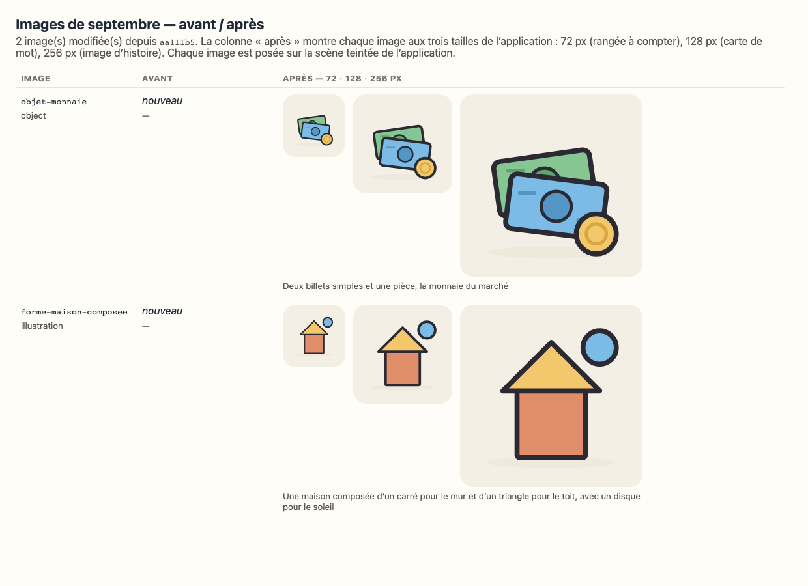

# September bounded corrections — independent reconfirmation brief

> **Status: ready for independent AI-assisted review.** This brief does not record or imply acceptance.

Use this cover sheet with the two generated before/after packages and the two-asset media sheet. The machine-readable manifest contains one complete record for each of the 27 affected lessons, including objectives, invariants and previous digest impact.

## Reviewer decision required

For every listed change, return **accepted**, **accepted-with-modifications**, or **rejected**, with a pedagogical rationale. A grouped verdict is valid only when it names every lesson/activity covered. Give an exact requested correction for every item not accepted. Review the two media assets separately.

Passing tests and builds establish technical integrity only. They are not pedagogical approval. No approval has been restored.

## Files in the review set

- `docs/review/2026-2027-maternelle-1-semaines-1-5-reconfirmation.md` — exact before/after fields for 1ère.
- `docs/review/2026-2027-maternelle-3-semaines-3-4-reconfirmation.md` — exact before/after fields for 3ème.
- `docs/review/2026-2027-september-corrections-reconfirmation-manifest.json` — one structured record per lesson and per new asset.
- `docs/review/media/septembre-corrections-media.png` — rendered assets at 72, 128 and 256 px.

## Invariants checked

- Learning objectives, supporting objectives and progression stages did not change.
- Activity minutes and lesson duration intent did not change.
- Parent guidance and affected adult guidance are byte-identical; safety guidance did not regress.
- Calendar, instructional order, lesson roles and curriculum mapping did not change.
- The 149 unaffected approvals remain unchanged. Exactly 27 lessons are at `review`; there are no additional stale approvals.

## Affected lessons

| Class | Week | Day | Lesson / activity | Field and audience | Reason | Objectives | Reviewer verdict |
| --- | ---: | ---: | --- | --- | --- | --- | --- |
| 1ère maternelle | 1 | 1 | `m1-phys-01` / `m1-phys-01-a1` | `payload` — renderer metadata / child-visible supporting steps | Replace unrelated generic running steps with the approved listen, move and stop-on-signal rule. | `PHYS-S04-C01-O03` | ☐ accepted ☐ accepted-with-modifications ☐ rejected |
| 1ère maternelle | 1 | 2 | `m1-phys-02` / `m1-phys-02-a1` | `payload` — renderer metadata / child-visible supporting steps | Replace unrelated generic steps with the approved safe run-to-marker, walking return and three-trip sequence. | `PHYS-S01-C01-O02` | ☐ accepted ☐ accepted-with-modifications ☐ rejected |
| 1ère maternelle | 1 | 3 | `m1-phys-03` / `m1-phys-03-a1` | `payload` — renderer metadata / child-visible supporting steps | Replace unrelated generic steps with the approved safe run-to-marker, walking return and three-trip sequence. | `PHYS-S01-C01-O02` | ☐ accepted ☐ accepted-with-modifications ☐ rejected |
| 1ère maternelle | 1 | 4 | `m1-phys-04` / `m1-phys-04-a1` | `payload` — renderer metadata / child-visible supporting steps | Replace unrelated generic running steps with the approved observe, imitate, invent and reciprocal-imitation sequence. | `PHYS-S03-C01-O01` | ☐ accepted ☐ accepted-with-modifications ☐ rejected |
| 1ère maternelle | 2 | 5 | `m1-phys-05` / `m1-phys-05-a1` | `payload` — renderer metadata / child-visible supporting steps | Replace unrelated generic steps with the approved safe run-to-marker, walking return and three-trip sequence. | `PHYS-S01-C01-O02` | ☐ accepted ☐ accepted-with-modifications ☐ rejected |
| 1ère maternelle | 2 | 6 | `m1-phys-06` / `m1-phys-06-a1` | `payload` — renderer metadata / child-visible supporting steps | Replace unrelated generic running steps with the approved aim, throw, retrieve and five-throw sequence. | `PHYS-S01-C01-O01` | ☐ accepted ☐ accepted-with-modifications ☐ rejected |
| 1ère maternelle | 2 | 7 | `m1-phys-07` / `m1-phys-07-a1` | `payload` — renderer metadata / child-visible supporting steps | Replace unrelated generic running steps with the approved observe, imitate, invent and reciprocal-imitation sequence. | `PHYS-S03-C01-O01` | ☐ accepted ☐ accepted-with-modifications ☐ rejected |
| 1ère maternelle | 2 | 8 | `m1-phys-08` / `m1-phys-08-a1` | `payload` — renderer metadata / child-visible supporting steps | Replace unrelated generic running steps with the approved aim, throw, retrieve and five-throw sequence. | `PHYS-S01-C01-O01` | ☐ accepted ☐ accepted-with-modifications ☐ rejected |
| 1ère maternelle | 2 | 9 | `m1-phys-09` / `m1-phys-09-a1` | `payload` — renderer metadata / child-visible supporting steps | Replace unrelated generic running steps with the approved line-walking support: optional adult hand, solo attempt and child-chosen continuation. | `PHYS-S02-C01-O01` | ☐ accepted ☐ accepted-with-modifications ☐ rejected |
| 1ère maternelle | 3 | 10 | `m1-phys-10` / `m1-phys-10-a1` | `payload` — renderer metadata / child-visible supporting steps | Replace unrelated generic steps with the approved safe run-to-marker, walking return and three-trip sequence. | `PHYS-S01-C01-O02` | ☐ accepted ☐ accepted-with-modifications ☐ rejected |
| 1ère maternelle | 3 | 11 | `m1-phys-11` / `m1-phys-11-a1` | `payload` — renderer metadata / child-visible supporting steps | Replace unrelated generic running steps with the approved aim, throw, retrieve and five-throw sequence. | `PHYS-S01-C01-O01` | ☐ accepted ☐ accepted-with-modifications ☐ rejected |
| 1ère maternelle | 3 | 12 | `m1-phys-12` / `m1-phys-12-a1` | `payload` — renderer metadata / child-visible supporting steps | Replace unrelated generic running steps with the approved line-walking support: optional adult hand, solo attempt and child-chosen continuation. | `PHYS-S02-C01-O01` | ☐ accepted ☐ accepted-with-modifications ☐ rejected |
| 1ère maternelle | 3 | 13 | `m1-phys-13` / `m1-phys-13-a1` | `payload` — renderer metadata / child-visible supporting steps | Replace unrelated generic running steps with the approved observe, imitate, invent and reciprocal-imitation sequence. | `PHYS-S03-C01-O01` | ☐ accepted ☐ accepted-with-modifications ☐ rejected |
| 1ère maternelle | 3 | 14 | `m1-phys-14` / `m1-phys-14-a1` | `payload` — renderer metadata / child-visible supporting steps | Replace unrelated generic steps with the approved safe run-to-marker, walking return and three-trip sequence. | `PHYS-S01-C01-O02` | ☐ accepted ☐ accepted-with-modifications ☐ rejected |
| 1ère maternelle | 4 | 15 | `m1-phys-15` / `m1-phys-15-a1` | `payload` — renderer metadata / child-visible supporting steps | Replace unrelated generic running steps with the approved aim, throw, retrieve and five-throw sequence. | `PHYS-S01-C01-O01` | ☐ accepted ☐ accepted-with-modifications ☐ rejected |
| 1ère maternelle | 4 | 16 | `m1-phys-16` / `m1-phys-16-a1` | `payload` — renderer metadata / child-visible supporting steps | Replace unrelated generic running steps with the approved line-walking support: optional adult hand, solo attempt and child-chosen continuation. | `PHYS-S02-C01-O01` | ☐ accepted ☐ accepted-with-modifications ☐ rejected |
| 1ère maternelle | 4 | 17 | `m1-phys-17` / `m1-phys-17-a1` | `payload` — renderer metadata / child-visible supporting steps | Replace unrelated generic running steps with the approved observe, imitate, invent and reciprocal-imitation sequence. | `PHYS-S03-C01-O01` | ☐ accepted ☐ accepted-with-modifications ☐ rejected |
| 1ère maternelle | 4 | 18 | `m1-phys-18` / `m1-phys-18-a1` | `payload` — renderer metadata / child-visible supporting steps | Replace unrelated generic steps with the approved safe run-to-marker, walking return and three-trip sequence. | `PHYS-S01-C01-O02` | ☐ accepted ☐ accepted-with-modifications ☐ rejected |
| 1ère maternelle | 4 | 19 | `m1-phys-19` / `m1-phys-19-a1` | `payload` — renderer metadata / child-visible supporting steps | Replace unrelated generic running steps with the approved aim, throw, retrieve and five-throw sequence. | `PHYS-S01-C01-O01` | ☐ accepted ☐ accepted-with-modifications ☐ rejected |
| 1ère maternelle | 5 | 20 | `m1-phys-20` / `m1-phys-20-a1` | `payload` — renderer metadata / child-visible supporting steps | Replace unrelated generic running steps with the approved line-walking support: optional adult hand, solo attempt and child-chosen continuation. | `PHYS-S02-C01-O01` | ☐ accepted ☐ accepted-with-modifications ☐ rejected |
| 1ère maternelle | 5 | 21 | `m1-phys-21` / `m1-phys-21-a1` | `payload` — renderer metadata / child-visible supporting steps | Replace unrelated generic running steps with the approved observe, imitate, invent and reciprocal-imitation sequence. | `PHYS-S03-C01-O01` | ☐ accepted ☐ accepted-with-modifications ☐ rejected |
| 1ère maternelle | 5 | 22 | `m1-phys-22` / `m1-phys-22-a1` | `payload` — renderer metadata / child-visible supporting steps | Make the supporting steps match the approved consolidation task: choose a game, hear its rule, then play together while keeping that rule. | `PHYS-S04-C01-O03` | ☐ accepted ☐ accepted-with-modifications ☐ rejected |
| 1ère maternelle | 4 | 16 | `m1-math-16` / `m1-math-16-a1` | `mediaIds` — media / child-facing reference | Remove the triangle, which had no valid destination in the approved open sort limited to rounds and squares. | `MATH-S03-C01-O01` | ☐ accepted ☐ accepted-with-modifications ☐ rejected |
| 1ère maternelle | 4 | 19 | `m1-math-19` / `m1-math-19-a1` | `mediaIds` — media / child-facing reference | Remove the triangle, which had no valid destination in the approved open sort limited to rounds and squares. | `MATH-S03-C01-O01` | ☐ accepted ☐ accepted-with-modifications ☐ rejected |
| 3ème maternelle | 3 | 12 | `m3-lang-12` / `m3-lang-12-a2` | `payload` — renderer metadata / child-visible spoken word bank | Supply the six words the approved adult guidance says to present one by one: two examples for each existing category. | `LANG-S01-C01-O02` | ☐ accepted ☐ accepted-with-modifications ☐ rejected |
| 3ème maternelle | 3 | 13 | `m3-lang-13` / `m3-lang-13-a2` | `mediaIds` — media / child-facing reference | Supply the missing fifth picture so « la monnaie » no longer appears as an empty word card. | `LANG-S01-C01-O03` | ☐ accepted ☐ accepted-with-modifications ☐ rejected |
| 3ème maternelle | 4 | 18 | `m3-math-18` / `m3-math-18-a2` | `mediaIds` — media / child-facing reference | Replace unrelated isolated shapes with one visible model of the approved square-wall and triangle-roof house. | `MATH-S03-C01-O08` | ☐ accepted ☐ accepted-with-modifications ☐ rejected |

The exact before and after values are in the two generated packages and repeated in the JSON manifest. For every row, progression, duration intent, child instruction and safety guidance are confirmed unchanged. The previous digest is recorded in the manifest; the current lesson has `status: review`, `review: null`, and no replacement digest.

## Renderer-only system change

For canonical activities already marked `off-screen`, the quantity, group/match and observation renderers now show a device handoff and, where useful, static reference material. They do not add a tappable counter, fixed-choice grading, sorting targets or completion praise. Hands-on pictures are labelled as examples rather than exact physical setups.

This is presentation logic outside lesson digests. It changes no child instruction, adult guidance, objective, duration, progression or safety text. The reviewer should confirm that it preserves the approved off-screen semantics.

**Renderer verdict:** ☐ accepted ☐ accepted-with-modifications ☐ rejected

## New media

### `objet-monnaie`

- **Purpose:** complete the five approved market words without introducing financial arithmetic.
- **Used by:** `m3-lang-13` / `m3-lang-13-a2`.
- **French accessibility description:** « Deux billets simples et une pièce, la monnaie du marché ».
- **Style check:** warm limited palette, simple silhouettes, controlled outline, one concept, readable at 72/128/256 px.
- **Detail check:** no numeral, denomination, named currency, flag, logo, exchange rate or calculation.
- **Verdict:** ☐ accepted ☐ accepted-with-modifications ☐ rejected

### `forme-maison-composee`

> The request used `forme-maison-compose`; the registered canonical ID is `forme-maison-composee`.

- **Purpose:** model the approved drawing with a square wall, triangular roof and optional disk sun.
- **Used by:** `m3-math-18` / `m3-math-18-a2`.
- **French accessibility description:** « Une maison composée d’un carré pour le mur et d’un triangle pour le toit, avec un disque pour le soleil ».
- **Style check:** warm limited palette, simple composition, controlled outline, one concept, readable at 72/128/256 px.
- **Detail check:** no extra door, window, text or shape to reproduce; the disk sun is explicitly allowed by the unchanged adult guidance.
- **Verdict:** ☐ accepted ☐ accepted-with-modifications ☐ rejected

## Approval consequence

- **Accepted:** record the explicit AI-assisted review decision, restore only the named lapsed lessons through the repository mechanism, compute fresh digests, and verify unaffected approval records are unchanged.
- **Accepted-with-modifications:** keep affected lessons at `review`, implement only requested corrections, regenerate the semantic diff and return it to the reviewer.
- **Rejected:** keep the relevant approvals lapsed and report the exact blocker.
