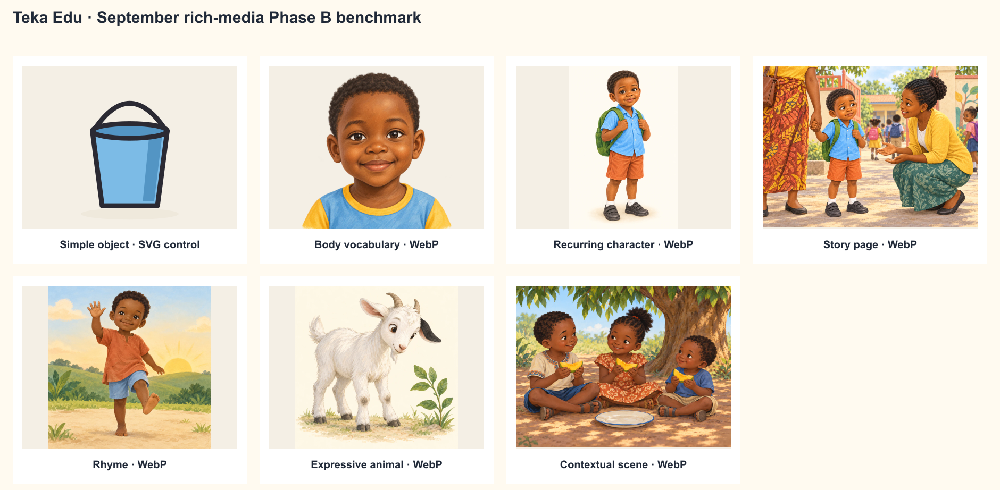

# September rich-media upgrade — Phase B benchmark

This is a review-only style benchmark. None of these candidates is registered in
`content/media/registry.json`, served by the application, included in a lesson digest, deployed, or approved.
The complete 51-asset decision matrix is [`september-rich-media-audit.md`](september-rich-media-audit.md).

## Proposed visual language

- Rich assets use warm hand-painted 2D children’s-book art with restrained gouache texture, readable
  silhouettes and controlled detail.
- The palette retains Teka Edu’s cream, muted sky blue, leaf green, sun yellow, terracotta, warm brown skin
  and charcoal accents, but tone and texture replace the current uniform heavy SVG outline.
- Human proportions remain recognizably preschool, with natural hands, feet and expressions. Emotion is
  readable without caricature.
- Context exists only when it carries the approved story action. Word-card body art remains isolated;
  narrative art receives a setting.
- Characters receive stable visual references before story sequences are generated. Nsimba’s reference and
  first story scene demonstrate the required identity continuity.
- WebP is the delivery format for rich raster art. High-quality PNG generation masters are retained only in
  ignored local evidence; they are not application assets.
- Existing SVG remains the benchmark for shapes, composed-shape models, counting diagrams and simple isolated
  objects that must stay crisp at 72–128 px.

## Seven benchmark categories

| Category         | Candidate                       | Format       | Review result                             | Why                                                                                                                                            |
| ---------------- | ------------------------------- | ------------ | ----------------------------------------- | ---------------------------------------------------------------------------------------------------------------------------------------------- |
| Simple object    | `objet-seau`                    | existing SVG | accepted control                          | Clear isolated silhouette, crisp at repeated small sizes; raster detail would add no teaching value.                                           |
| Body/vocabulary  | `corps-tete` candidate          | WebP         | accepted benchmark                        | A real child’s head is warm, anatomically legible and immediately human rather than an assembled icon.                                         |
| Person/character | Nsimba reference                | WebP         | accepted benchmark after one correction   | Stable face, clothing and backpack create a reusable identity. The first draft’s dark vignette was rejected and replaced with cream.           |
| Story            | Nsimba at the school gate       | WebP         | accepted benchmark                        | Shows the exact emotional story beat: trusted adult, hesitation and welcoming teacher, with controlled context.                                |
| Rhyme            | `Bonjour, petit` candidate      | WebP         | accepted benchmark                        | The greeting hand and lifted foot make the rhyme’s gesture readable without text inside the image.                                             |
| Animal           | Bibi character reference        | WebP         | accepted benchmark                        | The black ear patch is a stable identity cue; the goat remains recognizable and expressive without human clothing or speech.                   |
| Contextual scene | `La mangue partagée` resolution | WebP         | accepted after one pedagogical correction | Exactly three children each hold one piece. A first draft showed extra mangoes in the tree and was rejected; the corrected image removes them. |

## Candidate files

| File                      |  Dimensions |    Size | SHA-256                                                            |
| ------------------------- | ----------: | ------: | ------------------------------------------------------------------ |
| `corps-tete.webp`         | 1254 × 1254 | 280 KiB | `a994b3282b61700c110bc13b4768ab592137fa5860af4b55ec87c005e03c2f34` |
| `nsimba-character.webp`   | 1024 × 1536 | 124 KiB | `56fc195a5f155fd358a80c01c1bf6442c6d91cb2d1ad8b6ef80aa0ff620e30de` |
| `nsimba-school-gate.webp` | 1448 × 1086 | 376 KiB | `ebe4c21317b5de5dd1d374c673add4c46a241f7ce53e0d4a74936b25e0a412c6` |
| `comptine-bonjour.webp`   | 1254 × 1254 | 180 KiB | `14df7fa60947bcbc7f1fae3cf8a5475ec254ba812a5a5e3068f5e934317eb502` |
| `bibi-character.webp`     | 1254 × 1254 | 176 KiB | `dd41431db9e0359bf53634a5648c6c93a86c67e1c574689f55d5888e92a1f8b8` |
| `mangue-partagee.webp`    | 1448 × 1086 | 256 KiB | `0fdb54022b2e51ad42297c6c94908578414bd22dfe83859ecea3fcefd71e4cc1` |

All WebP candidates use quality 88 with chroma smart subsampling. The contact sheet is generated by
`scripts/rich-media-benchmark-sheet.mjs`.

## Final prompt set

All raster candidates used the built-in ImageGen path. Each prompt specified the target as professional,
hand-painted 2D preschool educational art with subtle gouache texture; the Teka Edu palette; clear phone-scale
composition; no text, watermark, logo, flag, glossy 3D, stock-art or flat-vector appearance; and culturally
respectful Congolese children or context where the approved story identifies them.

- **Body:** front-facing head and shoulders of one smiling Congolese preschool child, natural hair and visible
  ears, isolated on cream, with the head visually dominant.
- **Nsimba reference:** a five-year-old boy with short natural hair, sky-blue shirt, terracotta shorts and a
  leaf-green backpack, shown full-body for identity reuse. The accepted edit replaces only the rejected dark
  background.
- **Nsimba story:** preserve the reference identity; show him holding his adult’s hand at the school gate while
  a kind teacher crouches at eye level. Keep secondary children quiet and the emotional tone safe.
- **Rhyme:** one three-to-four-year-old child waves an open hand and lifts one bare foot while greeting the
  sunrise; both gestures must read at phone size.
- **Bibi:** one recognizable young white goat with short horns, small beard and a stable black patch on one ear,
  looking curiously at a leaf on an uncluttered cream ground.
- **Mango sharing:** exactly three children under a mango tree, each holding exactly one mango piece, with no
  other mango or piece visible. The accepted edit removes all hanging fruit from the first draft.

## Audit decision supported by the benchmark

- Keep 31 assets as SVG: 8 shapes, 17 isolated objects, the composed-shape house, three schematic rhyme/count
  models, the plant diagram and the articulated drawing model.
- Propose 20 registered asset replacements as WebP: 4 body references, 3 expressive animals, 10 stories and 3
  expressive rhymes.
- The 10 stories should use small sequences of 3–4 images aligned to existing renderer pages. Story wording,
  objectives, progression, duration and safety remain unchanged.
- A full proposed rollout would affect 53 unique approved lessons: 27 in 1ère maternelle and 26 in 3ème
  maternelle. This benchmark affects 0 lessons and 0 digests.

## Owner gate

The next implementation batch should begin only after the owner accepts the visual direction and the proposed
SVG/WebP boundary. Integration will then proceed in small groups with responsive phone, tablet, and
laptop/MacBook review and the
existing lapse/reconfirmation mechanism.
